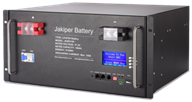
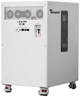
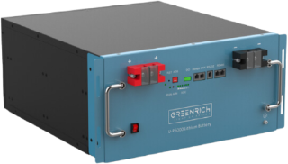
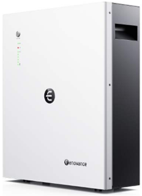

# esphome-pace-bms

This is an **ESPHome** component that supports "**paceic**" protocol **version 20 and 25** which is used by seemingly the majority of low-cost rack-mount and wall-mount Lithium Iron (LiFePO4) battery packs (but occasionally a different chemistry as well) manufactured in Asia for the consumer market.  Version 20 of this protocol is also sometimes called "PYLON" or "PylonTech" although this seems to be a misnomer.  The BMS can be communicated with over **RS485** or **RS232** and is manufactured by PACE (or is a clone).  It's used by many, many different manufacturers under different labels and branding.

   

The protocol is characterized by both requests and responses beginning with a '**~**' (tilde) character followed by two ASCII numbers (usually) either "**20**", "**21**", "**25**", or "**26**" and ending with a '**\r**' (carriage return) character.  

If you are a developer, the protocol implementation is fully portable with a clean interface in C++ and with no dependencies on ESPHome or any other libraries (it does require C++20 support due to use of some newer language features, though that could easily be removed).  Feel free to use it for whatever you wish, but a heads-up would be appreciated just so I know what's happening with it :)  I'm on discord as nkinnan_63071 or you can [file an issue](https://github.com/nkinnan/esphome-pace-bms/issues) to get in touch.

I strongly encourage you to read through this entire document if you plan to use this component, but here's a table of contents for quick reference:
- [What Is Paceic Protocol Version 20](#What-Is-Paceic-Protocol-Version-20)
- [What Is Paceic Protocol Version 25](#What-Is-Paceic-Protocol-Version-25)
- [What Is Pace MODBUS Protocol](#What-Is-Pace-MODBUS-Protocol)
- [Supported BMS Sensors (read only)](#Supported-BMS-Sensors-read-only)
- [Supported BMS Configuration (read / write)](#Supported-BMS-Configuration-read--write)
- [Supported BMS Configuration (read / write) - **Protocol Version 25 ONLY**](#Supported-BMS-Configuration-read--write---Protocol-Version-25-ONLY)
- [What Battery Packs are Supported?](#What-Battery-Packs-are-Supported)
- [What ESPs and RPs (and others) are Supported?](#What-ESPs-and-RPs-and-others-are-Supported)
- [How do I wire my ESP to the RS485 port?](#How-do-I-wire-my-ESP-to-the-RS485-port)
- [How do I wire my ESP to the RS232 port?](#How-do-I-wire-my-ESP-to-the-RS232-port)
- [ESPHome configuration YAML](#ESPHome-configuration-YAML)
  - [A note on logging](#A-note-on-logging)
  - [8266-specific settings](#8266-specific-settings)
  - [sub_devices](#sub_devices)
  - [external_components](#external_components)
  - [UART and pace_bms](#UART-and-pace_bms)
  - [Exposing the sensors (this is the good part!)](#Exposing-the-sensors-this-is-the-good-part)
    - [All read-only values](#All-read-only-values)
    - [Read-write values](#Read-write-values)
    - [Read-write values - Protocol Version 25 ONLY](#Read-write-values---Protocol-Version-25-ONLY)
  - [Support for multiple battery packs](#Support-for-multiple-battery-packs)
  - [Example Config Files](#Example-Config-Files)
- [How to configure a battery pack that's not in the supported list (yet)](#how-to-configure-a-battery-pack-thats-not-in-the-supported-list-yet)
- [Decoding the Status Values (but you probably don't want to)](#decoding-the-status-values-but-you-probably-dont-want-to)
  - [Paceic Version 25 RAW Status Values](#Paceic-Version-25-RAW-Status-Values)
  - [Paceic Version 20 RAW Status Values: PYLON variant](#Paceic-Version-20-RAW-Status-Values-PYLON-variant)
  - [Paceic Version 20 RAW Status Values: SEPLOS variant](#Paceic-Version-20-RAW-Status-Values-SEPLOS-variant)
  - [Paceic Version 20 RAW Status Values: EG4 variant](#Paceic-Version-20-RAW-Status-Values-EG4-variant)
- [I'm having a problem using this component](#Im-having-a-problem-using-this-component)
- [Miscellaneous Notes](#Miscellaneous-Notes)
- [Helping Out](#Helping-Out)

Example PACE BMS board:


# What Is Paceic Protocol Version 20

Also sometimes called "PYLON" or "PylonTech", this protocol version is spoken by older battery packs and has several variants, with firmware customized by individual manufacturers.  Three protocol variants are currently known/supported:
 - **EG4**
 - **PYLON**
 - **SEPLOS**

There is a high likelihood that one of these three version 20 protocol variants implemented by pace_bms will work for version 20 battery packs which are branded by a different manufacturer than the three listed.  I only named them for those manufacturers because I was able to find spec docs under those names - the same firmware / protocol variant may be used by many different brands.  But if you can find a spec doc for a new variant that behaves differently, I can probably add support for that too.  See [here](https://github.com/nkinnan/esphome-pace-bms/tree/main/protocol_documentation/paceic/0x20) for documentation on currently known version 20 protocol variants. 

Different manufacturers will have different BMS management software for version 20 battery packs.  It will not be PbmsTools, but one of a variety of manufacturer-specific affronts to good software design.  If your pack uses PbmsTools it's version 25.

The password for "Qualtech 48100 Test" aka "BMS_Test", the BMS management software for EG4 LIFEPOWER4 is "888888".  But there are legitimately some settings you shouldn't mess with - basically most of the stuff under the Config tab, but I wouldn't mess with overriding the firmware upgrade settings either).

These older BMSes will usually have two RS485 ports (looks like an ethernet socket) and may have an RS232 port (looks like a telephone socket).  They usually won't have a CAN bus port.

Example protocol version 20 BMS front-panel:


# What Is Paceic Protocol Version 25

This version seems more standardized, with an official protocol specification from PACE itself and a relatively consistent software management interface.  As far as I know, all newer battery packs speaking this protocol version should be supported.  See [here](https://github.com/nkinnan/esphome-pace-bms/tree/main/protocol_documentation/paceic/0x25) for documentation on protocol version 25.

These BMSes speaking paceic version 25 will invariably use PbmsTools for their BMS management software (or a rebadged version of it) which looks like this:


The exact look (or whether it has "pretty colors" like this) isn't important, just that the tabs and layout look the same.  This is PbmsTools regardless of any specific brand badging or interface tweaks, and indicates that your BMS supports protocol version 25.  

The default password to unlock all settings is "123456" incidentally.  But there are legitimately some settings you shouldn't mess with (I didn't implement those in this component - basically just the calibration stuff under the System Config tab).

These BMSes will typically have two or three RS485 ports (looks like an ethernet socket) an RS232 port (looks like a telephone socket) and possibly a CAN bus port and an LCD display as well, especially if newer.

Example protocol version 25 BMS front-panel:


# What Is Pace MODBUS Protocol

Some BMS firmwares also support reading data via MODBUS protocol over the RS485 port.  I haven't looked into this yet.  It seems like it may co-exist with Paceic version 25.  Documentation can be found [here](https://github.com/nkinnan/esphome-pace-bms/tree/main/protocol_documentation/modbus).  I may add support for this later, but since documentation is available, ESPHome already has native support for MODBUS, and syssi has already created an [ESPHome configuration for it](https://github.com/syssi/esphome-pace-bms), it's low priority.  

Using modbus for your pack means you will not be able to set any configuration values though, which is a major benefit / advantage of this esphome component.  Modbus will also not be able to read multiple chained together packs, which is something this component can do.

# Supported BMS Sensors (read only)

These *read-only* settings are supported for all protocol versions and variants, for both master and slave type BMSes unless otherwise noted.

- Multi-pack information *** Only available for `protocol_commandset: 0x25` and `type=MASTER`
  - **BMS Count** - How many packs in total the master BMS reports being connected
  - **Payload Count** - How many data payloads are returned by the master BMS on a broadcast request for analog or status information (this should match 'BMS Count' unless there is a problem) *** Additionally requires: `slave_query_mode: BROADCAST`

- All "Analog Information" (no restrictions)
  - **Cell Count**
  - **Cell Voltage** (V) - up to x16 depending on your battery pack
  - **Temperature Count**
  - **Temperature** (°C) - up to x6 depending on your battery pack (there is one brand that has 8), order is not guaranteed and varies by manufacturer but a typical setup might be:
    - *Cell Temperature* 1-4 
    - *MOSFET Temperature* 
    - *Environment Temperature*
  - **Total Voltage** (V)
  - **Current** (A) - positive or negative for charge/discharge
  - **Power** (W) - positive or negative for charge/discharge
  - **Remaining Capacity** (Ah)
  - **Full Capacity** (Ah)
  - **Design Capacity** (Ah)
  - **State of Charge** (%)
  - **State of Health** (%)
  - **Cycle Count**
  - **Minimum Cell Voltage** (V)
  - **Maximum Cell Voltage** (V)
  - **Average Cell Voltage** (V)
  - **Max Cell Differential** (V) - difference between minimum and maximum cell voltage
  
- All "Status Information" decoded to human-readable text format (no restrictions)
  - **Warning Text** - A list of any warnings reported by the BMS
  - **Protection Text** - If the BMS has protected itself or the cells, for example disabling charging if the temperature is too low, or a cell voltage is too high, it will be listed here
  - **Fault Text** - A list of any faults reported by the BMS
  - **System Text** - Current system status such as "Charging"
  - **Configuration Text** - System configuration such as "Warning Buzzer Enabled"
  - **Balancing Text** - If any cells are currently balancing, they will be listed here
  - **(individual status flag values)** - These are what the text fields are decoded from, and are documented separately.  You probably won't need them, but they are available.  There are a lot of them, and they vary by protocol version and variant.  See [Decoding the Status Values (but you probably don't want to)](#decoding-the-status-values-but-you-probably-dont-want-to) for more information on that.

These *read-only* settings are only available for `type=MASTER`

- **Hardware Version** - The BMS hardware version (string)
- **Serial Number** - The BMS serial number (string)

# Supported BMS Configuration (read / write)

These *writable* settings are only available for `type=MASTER`

- **System Date and Time** - Allows access to the BMS internal real-time clock
- **Shutdown** - A button which sends the shutdown command to the BMS (this will effectively cause a "reboot" unless the BMS is idle - any charge or discharge current will cause the BMS to immediately "wake up" making this "look like" a reboot instead of a shutdown)

# Supported BMS Configuration (read / write) - **Protocol Version 25 ONLY**

Its difficult to find good documentation on these protocols.  All the references I have are incomplete.  For version 25 I was able to snoop on the exchanges between PbmsTools and my battery pack in order to decode all of the commands necessary for reading/setting these configuration values.  However, the only battery pack I own which speaks version 20, is sending some very strange non-paceic commands for configuration settings.  Unfortunately I was unable to decode those, and even if I did, I don't think it would apply to all brands of battery pack speaking version 20.  For that reason, I didn't pursue it further, and these settings are only applicable to battery packs speaking paceic version 25.

These writable toggles and selects are supported by both `type=MASTER` and `type=SLAVE` BMSes, but for `type=SLAVE` they *become read-only*

- Toggles (switches) that turn various features on/off
  - **Buzzer Alarm**
  - **LED Alarm**
  - **Charge Current Limiter**
  - **Charge MOSFET**
  - **Discharge MOSFET**

- Selects (drop-lists) that allow configuring various features
  - **Charge Current Limiter Gear** - set to High or Low

These writable settings are supported by `type=MASTER` BMSes only

- Selects (drop-lists) that allow configuring various features
  - **Protocol (CAN)** - Allows selection of various protocols spoken on the CAN bus, typically to match your inverter
  - **Protocol (RS485)** - Allows selection of various protocols spoken on the RS485 bus, typically to match your inverter
  - **Protocol Type** - Auto or Manual
  
- Configuration (editable numbers)
  - Cell Over Voltage
  - **Cell Over Voltage Alarm** (V)
  - **Cell Over Voltage Protection** (V)
  - **Cell Over Voltage Protection Release** (V)
  - **Cell Over Voltage Delay** (seconds)
  - Pack Over Voltage
  - **Pack Over Voltage Alarm** (V)
  - **Pack Over Voltage Protection** (V)
  - **Pack Over Voltage Protection Release** (V)
  - **Pack Over Voltage Delay** (seconds)
  - Cell Under Voltage
  - **Cell Under Voltage Alarm** (V)
  - **Cell Under Voltage Protection** (V)
  - **Cell Under Voltage Protection Release** (V)
  - **Cell Under Voltage Delay** (seconds)
  - Pack Under Voltage
  - **Pack Under Voltage Alarm** (V)
  - **Pack Under Voltage Protection** (V)
  - **Pack Under Voltage Protection Release** (V)
  - **Pack Under Voltage Delay** (seconds)
  - Discharge Over Current 1
  - **Discharge Over Current 1 Alarm** (A)
  - **Discharge Over Current 1 Protection** (A)
  - **Discharge Over Current 1 Delay** (seconds)
  - Discharge Over Current 2
  - **Discharge Over Current 2 Protection** (A)
  - **Discharge Over Current 2 Delay** (seconds)
  - Discharge Short Circuit
  - **Discharge Short Circuit Protection Delay** (milliseconds)
  - Cell Balancing
  - **Cell Balancing Threshold** (V)
  - **Cell Balancing Delta** (V)
  - Sleep
  - **Sleep Cell Voltage** (V)
  - **Sleep Delay** (minutes)
  - Full Charge
  - **Full Charge Voltage** (V)
  - **Full Charge Amps** (A)
  - Low Charge
  - **Low Charge Alarm** (%)
  - Charge Over Temperature
  - **Charge Over Temperature Alarm** (°C)
  - **Charge Over Temperature Protection** (°C)
  - **Charge Over Temperature Protection Release** (°C)
  - Discharge Over Temperature
  - **Discharge Over Temperature Alarm** (°C)
  - **Discharge Over Temperature Protection** (°C)
  - **Discharge Over Temperature Protection Release** (°C)
  - Charge Under Temperature
  - **Charge Under Temperature Alarm** (°C)
  - **Charge Under Temperature Protection** (°C)
  - **Charge Under Temperature Protection Release** (°C)
  - Discharge Under Temperature
  - **Discharge Under Temperature Alarm** (°C)
  - **Discharge Under Temperature Protection** (°C)
  - **Discharge Under Temperature Protection Release** (°C)
  - MOSFET Over Temperature
  - **MOSFET Over Temperature Alarm** (°C)
  - **MOSFET Over Temperature Protection** (°C)
  - **MOSFET Over Temperature Protection Release** (°C)
  - Environment Over Temperature
  - **Environment Over Temperature Alarm** (°C)
  - **Environment Over Temperature Protection** (°C)
  - **Environment Over Temperature Protection Release** (°C)
  - Environment Under Temperature
  - **Environment Under Temperature Alarm** (°C)
  - **Environment Under Temperature Protection** (°C)
  - **Environment Under Temperature Protection Release** (°C)

# What Battery Packs are Supported?

**As far as I know, many/most.**  Any not listed should simply require a slightly different configuration (or might re-use one of the existing ones).  

However, I'd like to keep a full list here if only for search engine discoverability, so if you find that it does work with your battery pack, please contact me ([file an issue](https://github.com/nkinnan/esphome-pace-bms/issues)) with the configuration settings required, the make/model of battery pack (and a link to the exact model on the manufacturer's website if possible), and what it reports for the hardware version.

**If not listed**, for help figuring out the required settings to get your battery pack working, see [How to configure a battery pack that's not in the supported list (yet)](#how-to-configure-a-battery-pack-thats-not-in-the-supported-list-yet)

## Known working protocol version 20 battery packs:

- **EG4 LIFEPOWER4**
  - hardware versions: 
    - **QT-YS00-16SV100A-V3.6** aka QT_PBMS_EPBMS_48100_16S aka QT-EPBMS-48100-16S100Z0 aka QT-PBMS-48100
    - Related hardware versions: 48100-22S100Z0, 48500-16S500Z0, 24200-8S100Z0, etc.
      - 
  - required `pace_bms` config: 
    - `protocol_commandset: 0x20`
    - `protocol_variant: "EG4"`
    - `battery_chemistry: 0x4A`
  - notes:
    - Although the protocol documentation I have is labeled EG4, the BMS is manufactured by [Qualtech](http://qualtech.com.cn/en/).  Any battery pack using the same BMS would be supported.
    - The BMS is a bit slow, so don't reduce the timeouts too much. I have found the following settings prevent lockup from querying it too quickly:
      - `request_throttle: 200ms`
      - `response_timeout: 2000ms`


## Known working protocol version 25 battery packs:

- **Jakiper JK48V100**
  - BMS hardware versions: 
    - **P16S100A-1812-1.00**
    - Related hardware versions: [P16S100A-0004-20A](http://www.pacebms.com/en/index.php/shows/33/12.html), [P16S200A-0001-20A](http://www.pacebms.com/en/index.php/shows/33/66.html), [P16S150A-0001-20A](http://www.pacebms.com/en/index.php/shows/33/67.html), [P16S120A-0001-20A](http://www.pacebms.com/en/index.php/shows/33/68.html), [P16S50A-0001-10A](http://www.pacebms.com/en/index.php/shows/33/69.html), [P16S100A-0005-10A](http://www.pacebms.com/en/index.php/shows/33/77.html), [P16S100A-0001-10A](http://www.pacebms.com/en/index.php/shows/32/14.html), [P16S100A-0002-20A](http://www.pacebms.com/en/index.php/shows/32/11.html), 
    - 
  - required `pace_bms` config: 
    - `protocol_commandset: 0x25`

- **Easun Powerwall**
  - BMS hardware versions: 
    - **[IBattery-EA-51.2V-200AH](https://www.easun-energy.com/products/easun-5kwh-10kwh-powerwall-48v-lifepo4-battery-bms-communication)** / BMS: **P16S100A-32117-1.00** / PCB: **P16S100A-PX32117-20A-K4-10B**
    - Related: IBattery-EA-51.2V-100AH
      - 
  - required `pace_bms` config: 
    - `protocol_commandset: 0x25`
  - notes:
    - Thank you Mateusz for reporting.
    - The balancing information readouts are swapped between cells 1-8 and cells 9-16 as compared to the physical hardware.  So if you see cell 1 as balancing, it is actually physical cell 9 for example, and vice versa.  Thank you Haso-M for reporting.  

- **Tewaycell All-in-one Mobile ESS Hybrid off-grid Inverter**
  - BMS hardware versions: 
    - **[AO-MB-51200-10KW-WIFI](https://tewaycell.com/products/tewaycell-48v-400ah-20kwh-all-in-one-mobile-ess-built-in-hybrid-inverter)** / BMS: **P16S200A-21587-2.03**
    - SKUs: AO-MB-51200-10KW-WIFI, AO-MB-51300-10KW-S-WIFI, AO-MB-51400-10KW-S-WIFI, AO-MB-51300-10KW-T-WIFI, AO-MB-51400-10KW-T-WIFI, AO-MB-51200-10KW-None, AO-MB-51300-10KW-S-None, AO-MB-51400-10KW-S-None, AO-MB-51300-10KW-T-None, AO-MB-51400-10KW-T-None
    - Models: TW-AO-MB51300-AC380V-10KW-EU, TW-AO-MB51400-AC380V-10KW-EU, TW-AO-MB51300-10KW, TW-AO-MB51400-10KW, TW-AO-MB51200-10KW, TW-AO-MB-51300-AC380V-10KW-EU, TW-AO-MB-51400-AC380V-10KW-EU, TW-AO-MB-51300-10KW, TW-AO-MB-51400-10KW, TW-AO-MB-51200-10KW
      - 
  - required `pace_bms` config: 
    - `protocol_commandset: 0x25`
  - notes:
    - Thank you tbrasser for reporting.

- **GREENRICH U-P5000**
  - BMS hardware versions: 
    - **[U-P5000](https://greenrich.co.za/product/au7500-up5000-lithium-battery/)** / BMS: **P16S150A-17900-2.05W**
    - SKUs: AU7500, UP5000, U-P5000
    - Related Models: AU5500, UP3686, U-P3686, AU9000, UP6100, U-P6100
      - 
  - required `pace_bms` config: 
    - `protocol_commandset: 0x25`
  - notes:
    - Thank you RoganDawes for reporting.

- **FSP MES PS5120E**
  - BMS hardware versions: 
    - **[MES PS5120E](https://www.fsp-ps.de/en/product/pvinverter/1643012820-1712.html)** / BMS: **unconfirmed**
    - SKUs: PS5120E, PS 5120 E
    - Related Models: PS5120ES, PS 5120 ES
      - 
  - required `pace_bms` config: 
    - `protocol_commandset: 0x25`
  - notes:
    - Thank you MichaelEFlip for reporting.
    - Not confirmed yet that the ReadStatusInformation command will return proper results, but this BMS seems to be running the same firmware version as the GREENRICH U-P5000 which is confirmed working.

- **Eenovance MANA 10.6**
  - BMS hardware versions: 
    - **[Mana 10.6](https://renowatt.gr/wp-content/uploads/Solar-PDFs/MANA10-6.pdf)** / **[Brochure](https://www.eenovance.com/Public/Uploads/uploadfile/files/20250523/EenovanceProductsBrochureENV2.120250523S.pdf)** / BMS: P16S200A-C21084-3.10
    - SKUs: MANA 5.0, MANA 5.3, MANA 5.12, MANA 5.32, MANA 10.24, MANA 10.6, MANA 10.65, MANA 14.33, MANA 15.97, MANA 16.0
    - Related Models (may or may not be supported): MANA 5.12 Ultra, RT 5320, RT 11.77
      - 
  - required `pace_bms` config: 
    - `protocol_commandset: 0x25`
  - notes:
    - Thank you johnmsole for reporting.
    - The MANA line appears to be a Sunsynk rebadge.  The Eenovance MANA 10.6 appears to be a rebadged Sunsunk SUN-BATT-10.65 for example.

# What ESPs and RPs (and others) are Supported?

Both ESP8266 and ESP32 are supported, though an ESP32 class device is recommended.  The RP2040 (Raspberry Pi Pico W) should also work but I haven't tested it.  Other SOCs supported by ESPHome (they keep expanding support) may work also.  Contact me ([file an issue](https://github.com/nkinnan/esphome-pace-bms/issues)) if you try one, just to let me know.

Any board which gives you access to a hardware UART (both RX and TX) is fine.  Software UART on GPIO pins is *not recommended* and will likely result in dropped or corrupted messages.  

You cannot connect the UART RX/TX pins directly to either the RS232 or RS485 port, a converter chip for RS485 or RS232 signal levels is required.  Some boards may have such a converter chip built-in, or you can use a breakout board.  

RS485 will require at least one additional GPIO pin for flow control in addition to the UART RX and TX pins (usually).  RS232 will require only the UART RX and TX.

If using an 8266, you will need to redirect serial logs to the second UART (which is TX only, but that's fine for logging).  An example of how to do that is included below in the [YAML section](#8266-specific-settings).

# How do I wire my ESP to the RS485 port?

You will need a converter chip.  I have had success with the MAX485.  It's designed for 5v but I've had no issues using it at 3.3v with an ESP.  [Here](https://www.amazon.com/gp/product/B00NIOLNAG) is an example breakout board for the MAX485 chip.  You may be able to find ESP boards with such a chip already integrated.


This example breakout board separates out the flow control pins **DE** and **R̅E̅**, but they need to be tied together which you can do by either bridging the solder blobs on the back of the pins, or otherwise wiring both pins together.  

Some boards or more advanced tranceiver chips may have logic incorporated which automatically sets the flow control direction based on whether the TX pin is being toggled.  These boards/adapters won't need the flow control pin set and you can ignore references to **DE** and **R̅E̅**.  I haven't used such an adapter myself yet, but it should work fine.

Connect the breakout board to the **ESP**:
* **DI** (driver input) **->** ESP UART **TX** 
* **RO** (receiver output) **->** ESP UART **RX**
* **DE** (Driver Output Enable) and **R̅E̅** (Receiver Output Enable, active low) -> any ESP **GPIO**, from here out referred to as "the **Flow Control** pin"

Connect the breakout board to the **BMS**:
* **A** aka **D+** -> pin / blade **7** (white with a brown stripe if using ethernet cabling)
* **B** aka **D-** -> pin / blade **8** (solid brown if using ethernet cabling)


Lastly, don't forget to connect power (3.3v, do *not* use 5v) and ground to the breakout board.

# How do I wire my ESP to the RS232 port?

You will need a converter chip.  I have had success with the SP232.  It's compatible with the ESP 3.3v power and signaling levels.  [Here](https://www.amazon.com/gp/product/B091TN2ZPY) is an example breakout board for the SP232 chip.  You may be able to find ESP boards with such a chip already integrated.


Connect the breakout board to the **ESP**:
* TTL **RXD** **->** ESP UART **TX**
* TTL **TXD** **->** ESP UART **RX** 

Connect the breakout board to the **BMS**:
* RS232 **RXD** -> pin / blade **3** 
* RS232 **TXD** -> pin / blade **4** 
* RS232 **GND** -> pin / blade **5** 

**DON'T TRUST THE COLOR CODES** in this diagram, telephone cables are "straight through" and colors will be "mirrored" between the two ends of an extension cord.  Plus the wire colors aren't always standard.  **Use the pin/blade numbering** from the diagram for wiring the proper connections.  

Note that pin/blade **1 and 6 are usually left blank** but **STILL COUNT** for numbering!  

If cutting up a telephone extension cord, make sure it's "**dual line**" / has four wires and not just two.


Lastly, don't forget to connect power (3.3v, do *not* use 5v) and ground to the breakout board.

# ESPHome configuration YAML

A full ESPHome configuration will consist of thee parts:

1. The basic stuff like board type, wifi credentials, api or mqtt configuration, web_server if used, and so on. 
3. Configuration of the UART and the pace_bms component to speak with your battery pack.
4. Exposing the sensors / configuration values that you want accessible via the web_server dashboard, homeassistant, or mqtt.

I won't go over 1 since that will be specific to your setup, except to say that if you want to use `web_server` then you should probably add `version: 3` and click the dark mode icon whenever you open it up.  It is a *significant* improvement over version 2, but not yet set as the default, and some of the color choices indicate it was designed in dark mode since they don't work as well with a white background - mainly the logging colors.

sub-sections:
- [A note on logging](#A-note-on-logging)
- [8266-specific settings](#8266-specific-settings)
- [sub_devices](#sub_devices)
- [external_components](#external_components)
- [UART and pace_bms](#UART-and-pace_bms)
- [Exposing the sensors (this is the good part!)](#Exposing-the-sensors-this-is-the-good-part)
  - [All read-only values](#All-read-only-values)
  - [Read-write values](#Read-write-values)
  - [Read-write values - Protocol Version 25 ONLY](#Read-write-values---Protocol-Version-25-ONLY)
- [Support for multiple battery packs](#Support-for-multiple-battery-packs)
- [Example Config Files (in full)](#Example-Config-Files-in-full)

## A note on logging

While initially setting up this component, I'd strongly recommend setting log level to VERY_VERBOSE.  You can reduce that back to INFO or higher once you confirm everything is working.  If you want to submit logs on an issue report, please gather them with log level VERY_VERBOSE (*but* also reduce the number of sensors to a minimum, or the log will just be a mess!) as VERY_VERBOSE will include the actual strings sent to/from the BMS over the UART which is important for debugging.

```yaml
logger:
  #level: INFO
  #level: DEBUG
  #level: VERBOSE
  level: VERY_VERBOSE
```
Additionally, if you want to get serial logs over USB, on *some boards* (different boards may or may not contain a USB-to-serial bridge chip) with *some ESP32 variants* (some variants have a software usb stack, some are dual-stack including a built-in hardware jtag option which functions similarly, but not the same, as a hardware USB-to-serial bridge chip), etc, then you may need to add something like this to your logger config. 

```yaml
logger:
  hardware_uart: USB_CDC 
```
On boards with two USB ports, this will depend on which port you're plugged into. This will also depend on whether you are using the Arduino or (recommended) ESP-IDF framework/platform. Usually the defaults work, but if you see no logs then you should double check the [esphome logger documentation](https://esphome.io/components/logger/#default-hardware-interfaces) for more details.

## 8266-specific settings

Since an 8266 only has 1.5 UARTs (a full UART 0 with rx+tx and half of a UART 1 with tx only) we need to redirect log output to UART 1 so we can fully utilize UART 0 for communication with the BMS.  You can do that like so:
```yaml
logger:
  hardware_uart: UART1 # using UART0 for BMS communications
```

## sub_devices

If you have multiple battery packs, the easiest way to manage the "duplicate" sensor names is with esphome's [sub-devices](https://esphome.io/components/esphome/#sub-devices) functionality.

```yaml
esphome:
  <...configuration...>

  devices:
    - id: device_group_master_bms_address_1
      name: "Master BMS Address 01"
    - id: device_group_slave_bms_address_2
      name: "Slave BMS Address 02"
```

How to reference these sub-devices will be noted later in the relevant sections.  Basically all this does is allow you to prefix the sub-device name onto each sensors/etc so the names do not conflict between battery packs in a multi-pack setup.  You can and should omit this for a single battery pack (or if you have one ESP per pack).

## external_components

Before anything else, you will need to tell ESPHome where to find this component.  Add the following lines to your YAML:

```yaml
external_components:
  - source:
      type: git
      url: https://github.com/nkinnan/esphome-pace-bms
      ref: "main"
    components: [ pace_bms ]
    refresh: 1s
```

## UART and pace_bms

Next, lets configure the UART and pace_bms component to speak with your BMS.

```yaml
uart:
  id: uart_0
  baud_rate: 9600 
  tx_pin: GPIO2
  rx_pin: GPIO1
  rx_buffer_size: 256
```
* **baud_rate:** The most common value for baud_rate is 9600, but some BMSes are reported to use 19200 as well.  You should know what this value is, from previously communicating with the BMS using the manufacturer's recommended software.
* **tx_pin / rx_pin:** Self-explanatory, see previous sections on wiring your ESP to the RS232 or RS485 port. 
* **rx_buffer_size:** This value should match the `rx_buffer_size` set under the `pace_bms` component with `type=MASTER` (or with `type` omitted since MASTER is the default value).  A size of 256 is recommended for a single battery pack (or if you have one ESP per pack).  For a multiple battery pack setup, see [multi-pack configuration](#Support-for-multiple-battery-packs) for more information.
```yaml
pace_bms:
  id: master_pace_bms_at_address_1
  address: 1
  responding_address: 1
  device_id: 

  uart_id: uart_0
  flow_control_pin: GPIO0 
  update_interval: 5s
  request_throttle: 200ms # should be reduced to 50ms for protocol 25
  response_timeout: 2000ms # may be reduced to 1000ms for protocol 25 (but if you're getting timeouts there's some kind of problem)

  protocol_commandset: 0x20 # example only
  protocol_variant: "EG4"   # example only
  protocol_version: 0x20    # example only
  battery_chemistry: 0x4A   # example only

  # multi-pack configuration only (ignore/omit if you have only a single battery pack, or one ESP per pack)
  type: MASTER
  master_bms_id: master_pace_bms_at_address_1
  slave_discovery_mode: NONE
  slave_query_mode: BROADCAST
  rx_buffer_size: 256
```
Many of these settings are only applicable to a `type=MASTER` (or with type omitted since MASTER is the default value) BMS.  To configure a slave BMS in a multi-pack setup, see [multi-pack configuration](#Support-for-multiple-battery-packs).  

* **address:** This is the address of your BMS, set with the DIP switches on the front next to the RS232 and RS485 ports.  **Important:** If you change the setting of the DIP switches, you'll need to reset the BMS for the new address to take effect.  Either by flipping the breaker, or using something like a toothpick or push-pin to depress the recessed reset button.  The lights on the front panel will flicker or "dance" if you have reset correctly.  You probably want to configure your pack as address 1 (this is the default if not specified), unless your battery packs are daisy chained in which case see [multi-pack configuration](#Support-for-multiple-battery-packs) for more information.
* **responding_address:** Do not include this by default. It should only be added if you need it. If you see an error log that looks like: `Response from wrong bus Id in header, expected 2 but got 1` that means you asked for data from the BMS at address 2, but the BMS at address 1 responded (or at least appeared to). This can happen in certain multi-pack setups or in case of a BMS firmware bug. If you know that the response you are getting is correct, and from the correct BMS, you can ignore the error by setting this value appropriately based on the error log. An example where you might want to do this: you're talking to a BMS on the RS232 port that is part of a master/slave setup, and it has its DIP switches set to address 2; it might respond "as if" it expects to be relayed by the master BMS at address 1 by putting a 1 in the response header instead of it's own address.
* **device_id:** This has nothing to do with the BMS, it is actually to support the [sub-devices](https://esphome.io/components/esphome/#sub-devices) functionality of esphome.  This can be important in multi-pack setups, but for a single battery pack (or if you have one ESP per pack) this can (and should) be omitted.  See [multi-pack configuration](#Support-for-multiple-battery-packs) for more information.  
> [!NOTE]
> The `device_id` property is propagated down to each sensor platform which points back to this `pace_bms` entry, and then subsequently down to the individual sensors.  This is contrary to esphome spec, and implemented via custom yaml config processing by this component.  It just makes things easier, so that you don't have to mark each and every sensor with the `device_id` of the sub-device you would like it assigned to.  For this "magic" to work however, the `pace_bms` configuration entry must come prior to the sensor configuration entries in your device yaml, and the yaml must be a single unified file.  If you're using things like `!include` however, then the individual sensor/etc platforms will need to be decorated with `device_id` instead.  This is also noted later on, where it becomes relevant.
* **uart_id:** The ID of the UART you configured, which is connected to either the RS232 or RS485 port of the BMS.
* **flow_control_pin:** If NOT using RS485, this setting should be omitted.  If using RS485, this is required to be set (usually), as it controls the direction of communication on the RS485 bus.  It should be connected to *both* the **DE** (Driver Output Enable) and **R̅E̅** (Receiver Output Enable, active low) pins on the RS485 adapter / breakout board.  If you are using a RS485 adapter / breakout board which does not have **DE** and **R̅E̅** pins (or possibly just a single pin labeled "write" or something similar) then it may be a chip that snoops on traffic and performs this function automatically, in which case this setting can be omitted.  Enabling this setting requires the ESP to halt all processing while data is sent to the BMS, so it should not be specified unless it is actually needed.
* **update_interval:** How often to query the BMS and publish whatever updated values are read back.  What queries are sent to the BMS is determined by what values you have requested to be published (what sensors you have configured, essentially) in [the rest of your configuration](#Exposing-the-sensors-this-is-the-good-part).
* **request_throttle:** Minimum interval between sending requests to the BMS.  Increasing this may help if your BMS "locks up" after a while, it's probably getting overwhelmed.  
* **response_timeout:** Maximum time to wait for a response before "giving up" and sending the next.  Increasing this may help if your BMS "locks up" after a while, it's probably getting overwhelmed.  Multi-pack setups will require a significantly larger value for this setting since querying the master BMS for all data requires it to then query all the slaves before responding (depending on `slave_query_mode`).  See [multi-pack configuration](#Support-for-multiple-battery-packs) for more information.

* **protocol_commandset, protocol_variant, protocol_version,** and **battery_chemistry:** 
   - Consider these as a set.  Use values from the [known supported list](#What-Battery-Packs-are-Supported), or determine them manually by following the steps in [How to configure a battery pack that's not in the supported list (yet)](#how-to-configure-a-battery-pack-thats-not-in-the-supported-list-yet)

* **type:** Defaults to `MASTER`, can be either `MASTER` or `SLAVE`.  Should be omitted if you only have a single battery pack (or if you have one ESP per pack).  See [multi-pack configuration](#Support-for-multiple-battery-packs) for more information.  
* **master_bms_id:** For a `type=SLAVE` BMS only, this is the `id` of the `type=MASTER` BMS that this is slaved to.
* **slave_discovery_mode:** Defaults to `NONE`, can be one of: `NONE`, `RELAY`, `BROADCAST`, or `RELAY_AND_BROADCAST`.  Should be omitted ~~if you only have a single battery pack (or if you have one ESP per pack)~~ unless you are debugging issues with a multi-pack setup.  It does not do anything useful in a working config, but it might be something that I ask you to get logs from in order to help troubleshoot.  See [multi-pack configuration](#Support-for-multiple-battery-packs) for more information.  
* **slave_query_mode:** Defaults to `BROADCAST`, can be either: `BROADCAST`, or `RELAY`.  Should be omitted if you only have a single battery pack (or if you have one ESP per pack).  This determines how slave battery packs are queried in a multi-pack setup.  See [multi-pack configuration](#Support-for-multiple-battery-packs) for more information.
* **rx_buffer_size:** This value should match the `rx_buffer_size` set under the `uart` component.  A size of 256 is recommended for a single battery pack (or if you have one ESP per pack) and is the default if not specified.  For a multiple battery pack setup, see [multi-pack configuration](#Support-for-multiple-battery-packs) for more information.

## Exposing the sensors (this is the good part!)

Next, lets go over making things available to the web_server dashboard, homeassistant, or mqtt.  This is going to differ slightly depending on what data you want to read back from the BMS.  I will provide a complete example which you can pare down to only what you want to see.

> [!WARNING]
> If you're using [sub-devices](https://esphome.io/components/esphome/#sub-devices) in a multi-pack setup, and also things like `!include` that cause your yaml to be broken up into multiple files, then the custom yaml processing allowing you to add `device_id` under `pace_bms` alone, and have that automatically "flow down" to all sensors may not work.  However, you can still avoid the need to decorate each individual sensor with `device_id` by simply adding it at the platform level instead:
> ```yaml
> sensor:
>  - platform: pace_bms
>    pace_bms_id: master_pace_bms_at_address_1
>    device_id: device_group_master_bms_address_1
>
>    <...sensors for BMS 1...>
>
>   - platform: pace_bms
>     pace_bms_id: slave_pace_bms_at_address_2
>     device_id: device_group_slave_bms_address_2
>
>    <...sensors for BMS 2...>
> ```
> (and so on)

### All read-only values
```yaml
sensor:
  - platform: pace_bms
    pace_bms_id: master_pace_bms_at_address_1

    # (`type=MASTER` and `protocol_commandset=0x25` BMSes only)
    bms_count:
      name: "BMS Count"
    # (`type=MASTER` and `protocol_commandset=0x25` BMSes only, requires `slave_query_mode: BROADCAST`)
    payload_count:
      name: "Payload Count"

    cell_count:
      name: "Cell Count"

    cell_voltage_01:
      name: "Cell Voltage 01"
    cell_voltage_02:
      name: "Cell Voltage 02"
    cell_voltage_03:
      name: "Cell Voltage 03"
    cell_voltage_04:
      name: "Cell Voltage 04"
    cell_voltage_05:
      name: "Cell Voltage 05"
    cell_voltage_06:
      name: "Cell Voltage 06"
    cell_voltage_07:
      name: "Cell Voltage 07"
    cell_voltage_08:
      name: "Cell Voltage 08" 
    cell_voltage_09:
      name: "Cell Voltage 09"
    cell_voltage_10:
      name: "Cell Voltage 10"
    cell_voltage_11:
      name: "Cell Voltage 11"
    cell_voltage_12:
      name: "Cell Voltage 12"
    cell_voltage_13:
      name: "Cell Voltage 13"
    cell_voltage_14:
      name: "Cell Voltage 14"
    cell_voltage_15:
      name: "Cell Voltage 15"
    cell_voltage_16:
      name: "Cell Voltage 16"

    temperature_count:
      name: "Temperature Count"

    # Generally the first four (or last four) temperatures are cell measurements and the other two are 
    # MOSFET / Environment or Environment / MOSFET, but this is manufacturer specific
    temperature_01:
      name: "Cell Temperature 1"
    temperature_02:
      name: "Cell Temperature 2"
    temperature_03:
      name: "Cell Temperature 3"
    temperature_04:
      name: "Cell Temperature 4"
    temperature_05:
      name: "MOSFET Temperature"
    temperature_06:
      name: "Environment Temperature"

    total_voltage:
      name: "Total Voltage"
    current:
      name: "Current"
    power:
      name: "Power"

    remaining_capacity:
      name: "Remaining Capacity"
    full_capacity:
      name: "Full Capacity"
    design_capacity: # not available on EG4 protocol 0x20 variant
      name: "Design Capacity"

    state_of_charge:
      name: "State of Charge"
    state_of_health:
      name: "State of Health"
    cycle_count:
      name: "Cycle Count"

    min_cell_voltage:
      name: "Min Cell Voltage"
    max_cell_voltage:
      name: "Max Cell Voltage"
    avg_cell_voltage:
      name: "Avg Cell Voltage"
    max_cell_differential:
      name: "Max Cell Differential"

text_sensor:
  - platform: pace_bms
    pace_bms_id: master_pace_bms_at_address_1

    # (`type=MASTER` BMSes only)
    hardware_version:
      name: "Hardware Version"
    # (`type=MASTER` BMSes only)
    serial_number: # not available on EG4 protocol 0x20 variant
      name: "Serial Number"

    # pre-decoded human readable text strings that describe all of the specific status values and are suitable for display
    warning_status:
      name: "Warning Status"
    protection_status:
      name: "Protection Status"
    fault_status:
      name: "Fault Status"
    system_status:
      name: "System Status"
    configuration_status:
      name: "Configuration Status"
    balancing_status:
      name: "Balancing Status"

```

### Read-write values

All of these writable settings are supported by `type=MASTER` BMSes only

```yaml
datetime:
  - platform: pace_bms
    pace_bms_id: master_pace_bms_at_address_1

    # (`type=MASTER` BMSes only)
    system_date_and_time:
      name: "System Date and Time"

button:
  - platform: pace_bms
    pace_bms_id: master_pace_bms_at_address_1

    # (`type=MASTER` BMSes only)
    shutdown:
      name: "Shutdown" # will actually "reboot" if the battery is charging/discharging - it only stays shut down if idle
```
### Read-write values - Protocol Version 25 ONLY

```yaml
switch:
  - platform: pace_bms
    pace_bms_id: master_pace_bms_at_address_1

    # (for `type=SLAVE` BMSes this will become read-only)
    buzzer_alarm:
      name: "Buzzer Alarm"
    # (for `type=SLAVE` BMSes this will become read-only)
    led_alarm:
      name: "Led Alarm"
    # (for `type=SLAVE` BMSes this will become read-only)
    charge_current_limiter:
      name: "Charge Current Limiter"
    # (for `type=SLAVE` BMSes this will become read-only)
    charge_mosfet:
      name: "Charge Mosfet"
    # (for `type=SLAVE` BMSes this will become read-only)
    discharge_mosfet:
      name: "Discharge Mosfet"


select:
  - platform: pace_bms
    pace_bms_id: master_pace_bms_at_address_1

    # (for `type=SLAVE` BMSes this will become read-only)
    charge_current_limiter_gear:
      name: "Charge Current Limiter Gear"

    # setting the protocol is possible on some version 25 BMSes but not all
    # (`type=MASTER` BMSes only)
    protocol_can:
      name: "Protocol (CAN)"
    # (`type=MASTER` BMSes only)
    protocol_rs485:
      name: "Protocol (RS485)"
    # (`type=MASTER` BMSes only)
    protocol_type:
      name: "Protocol (Type)"


number:
  - platform: pace_bms
    pace_bms_id: master_pace_bms_at_address_1

    # (the ENTIRE `number` section is available for `type=MASTER` BMSes only)

    cell_over_voltage_alarm:
      name: "Cell Over Voltage Alarm" 
    cell_over_voltage_protection:
      name: "Cell Over Voltage Protection" 
    cell_over_voltage_protection_release:
      name: "Cell Over Voltage Protection Release" 
    cell_over_voltage_protection_delay:
      name: "Cell Over Voltage Protection Delay" 
 
    pack_over_voltage_alarm:
      name: "Pack Over Voltage Alarm" 
    pack_over_voltage_protection:
      name: "Pack Over Voltage Protection" 
    pack_over_voltage_protection_release:
      name: "Pack Over Voltage Protection Release" 
    pack_over_voltage_protection_delay:
      name: "Pack Over Voltage Protection Delay" 
 
    cell_under_voltage_alarm:
      name: "Cell Under Voltage Alarm" 
    cell_under_voltage_protection:
      name: "Cell Under Voltage Protection" 
    cell_under_voltage_protection_release:
      name: "Cell Under Voltage Protection Release" 
    cell_under_voltage_protection_delay:
      name: "Cell Under Voltage Protection Delay" 
 
    pack_under_voltage_alarm:
      name: "Pack Under Voltage Alarm" 
    pack_under_voltage_protection:
      name: "Pack Under Voltage Protection" 
    pack_under_voltage_protection_release:
      name: "Pack Under Voltage Protection Release" 
    pack_under_voltage_protection_delay:
      name: "Pack Under Voltage Protection Delay" 
 
    charge_over_current_alarm:
      name: "Charge Over Current Alarm" 
    charge_over_current_protection:
      name: "Charge Over Current Protection" 
    charge_over_current_protection_delay:
      name: "Charge Over Current Protection Delay" 
 
    discharge_over_current1_alarm:
      name: "Discharge Over Current 1 Alarm" 
    discharge_over_current1_protection:
      name: "Discharge Over Current 1 Protection" 
    discharge_over_current1_protection_delay:
      name: "Discharge Over Current 1 Protection Delay" 
 
    discharge_over_current2_protection:
      name: "Discharge Over Current 2 Protection" 
    discharge_over_current2_protection_delay:
      name: "Discharge Over Current 2 Protection Delay" 
 
    short_circuit_protection_delay:
      name: "Short Circuit Protection Delay (Milliseconds)" 
 
    cell_balancing_threshold:
      name: "Cell Balancing Threshold"
    cell_balancing_delta:
      name: "Cell Balancing Delta"
 
    sleep_cell_voltage:
      name: "Sleep Cell Voltage"
    sleep_delay:
      name: "Sleep Delay (Minutes)"
 
    full_charge_voltage:
      name: "Full Charge Voltage"
    full_charge_amps:
      name: "Full Charge Amps"
    low_charge_alarm_percent:
      name: "Low Charge Alarm Percent"
 
    charge_over_temperature_alarm:
      name: "Charge Over Temperature Alarm"
    charge_over_temperature_protection:
      name: "Charge Over Temperature Protection"
    charge_over_temperature_protection_release:
      name: "Charge Over Temperature Protection Release"
 
    discharge_over_temperature_alarm:
      name: "Discharge Over Temperature Alarm"
    discharge_over_temperature_protection:
      name: "Discharge Over Temperature Protection"
    discharge_over_temperature_protection_release:
      name: "Discharge Over Temperature Protection Release"
 
    charge_under_temperature_alarm:
      name: "Charge Under Temperature Alarm"
    charge_under_temperature_protection:
      name: "Charge Under Temperature Protection"
    charge_under_temperature_protection_release:
      name: "Charge Under Temperature Protection Release"
 
    discharge_under_temperature_alarm:
      name: "Discharge Under Temperature Alarm"
    discharge_under_temperature_protection:
      name: "Discharge Under Temperature Protection"
    discharge_under_temperature_protection_release:
      name: "Discharge Under Temperature Protection Release"
 
    mosfet_over_temperature_alarm:
      name: "Mosfet Over Temperature Alarm"
    mosfet_over_temperature_protection:
      name: "Mosfet Over Temperature Protection"
    mosfet_over_temperature_protection_release:
      name: "Mosfet Over Temperature Protection Release"
 
    environment_over_temperature_alarm:
      name: "Environment Over Temperature Alarm"
    environment_over_temperature_protection:
      name: "Environment Over Temperature Protection"
    environment_over_temperature_protection_release:
      name: "Environment Over Temperature Protection Release"
 
    environment_under_temperature_alarm:
      name: "Environment Under Temperature Alarm"
    environment_under_temperature_protection:
      name: "Environment Under Temperature Protection"
    environment_under_temperature_protection_release:
      name: "Environment Under Temperature Protection Release"
```

## Support for multiple battery packs

This section will describe the changes you need to make, to move from a single battery pack to a multiple battery pack setup.  If you don't have a single pack (master BMS, at address 1) working already, you should go back and do that first.  Then you can return here to see how to add additional slave packs into your config.

Multiple battery packs is currently only supported for protocol 0x25.  It is unlikely I will add multi-pack support for 0x20 due to the fact that it's older, most of the issues / requests that I get are about 0x25, and there are a number of 0x20 variants (with wildly different protocol formats) so the test burden would be high.  If you have a setup with multiple battery packs speaking a 0x20 protocol variant, feel free to contact me about it ([file an issue](https://github.com/nkinnan/esphome-pace-bms/issues)) but I will probably decline even if you're able to test that out for me.  You can still get data from all of them by simply using one ESP per BMS.

The first thing to do is mark your BMS as MASTER.  This is the default, but it's good practice anyway to make it explicit in a multi-pack setup.  Makes the yaml easier to read.
```yaml
pace_bms:
  # the rest of the master BMS settings are omitted for brevity
  type: MASTER
```

Next, you need to decide whether to query the slave BMSes in "broadcast" or "relay" mode.  Broadcast means that this component will send a request for information to a special 0xFF address which means "return data for all packs in a single response".  Relay means that this component will ask the master BMS to forward requests for information to each slave one at a time.  Differences:
1) Broadcast requires a larger receive buffer for both this component and it's uart.  Generally 256 * (number of BMSes).  Relay mode can leave the buffer sizes at 256 since responses aren't returned in concatenated form.  The buffers still won't get large enough, even with a 16 pack setup, to become a big issue unless your ESP is under memory pressure for some reason (running LVGL maybe?)
2) I have seen cases where the firmware has bugs in it when responding in relay mode.  Payload sizes are off by a couple of bytes, that kind of thing.  This can cause warnings or errors in processing.  But it's still a valid method, and available to select if you have some reason to do so.

Both modes are fully supported, but my recommendation is to use broadcast mode:

```yaml
pace_bms:
  # the rest of the master BMS settings are omitted for brevity
  type: MASTER
  slave_query_mode: BROADCAST
```

For `slave_query_mode: BROADCAST`, you will also need to update the `response_timeout` setting to allow the master BMS enough time to gather the requested information from all the slaves.  A safe starting point would be 2 seconds times the number of BMSes.  So if you have 4 battery packs, that would be 8 seconds, or `8000ms` (this is probably a bit excessive, but "better safe than sorry" - you can reduce it with testing, although there is not much benefit to doing so):

```yaml
pace_bms:
  # the rest of the master BMS settings are omitted for brevity
  type: MASTER
  slave_query_mode: BROADCAST
  response_timeout: 8000ms # 2000 * 4, for four battery packs in this system
```
If you've set `slave_query_mode: RELAY` then I would set the `response_timeout` to `2000ms`.

Next, again for `slave_query_mode: BROADCAST` only, we need to calculate how big to make the receive buffers.  This should be 256 times the number of BMSes.  So if you have 4 battery packs, the value would be 1024.  Be sure to set this on both your uart and pace_bms configs:

```yaml
uart:
  id: uart_0
  rx_buffer_size: 1024 # 256 * 4, for four battery packs in this system

pace_bms:
  # the rest of the master BMS settings are omitted for brevity
  type: MASTER
  slave_query_mode: BROADCAST
  response_timeout: 8000ms # 2000 * 4, for four battery packs in this system
  uart_id: uart_0
  rx_buffer_size: 1024 # 256 * 4, for four battery packs in this system
```

Next, lets define some slave BMSes.  The configuration section for slaves will be much shorter than for the master BMS.  You will need to convert the yaml entry into a list by using the "-" list item indicator and increasing the indentation.  Be sure to specify both the address and a pointer back to the master BMS:

```yaml
pace_bms:
  - id: master_pace_bms_at_address_1 
    type: MASTER
    address: 1
    # the rest of the master BMS settings are omitted for brevity

  - id: slave_pace_bms_at_address_2
    type: SLAVE
    master_bms_id: master_pace_bms_at_address_1 # slaves must point back to the master
    address: 2

  - id: slave_pace_bms_at_address_3
    type: SLAVE
    master_bms_id: master_pace_bms_at_address_1 # slaves must point back to the master
    address: 3

  - id: slave_pace_bms_at_address_4
    type: SLAVE
    master_bms_id: master_pace_bms_at_address_1 # slaves must point back to the master
    address: 4
```

That's pretty much it as far as slave BMSes go.  All of the configuration is done through the entry for the master BMS.  Just make sure you have the address settings correct, matching the DIP switch settings on the front panel of the battery pack.

You'll also want to be sure to make use of ESPHome's [sub-device functionality](https://esphome.io/components/esphome/#sub-devices).  By specifying a sub-device name, you can copy / paste the sensor configuration for your master BMS to your slaves without having to change the sensor names.  Otherwise something like "Total Voltage" on both the master, and a slave, would "collide" and fail to compile.  By specifying a "sub-device name" for each of the BMSes, those sensor names will be prefixed and end up looking something like "Master BMS Address 1 Total Voltage" and "Slave BMS Address 2 Total Voltage" and so on, so there is no naming collision.  The exact naming of the sensors depends on how you define your sub-devices.  You can do that like this:

```yaml
esphome:
  devices:
    - id: device_group_master_bms_address_1
      name: "Master BMS Address 1"
    - id: device_group_slave_bms_address_2
      name: "Slave BMS Address 2"
    - id: device_group_slave_bms_address_3
      name: "Slave BMS Address 3"
    - id: device_group_slave_bms_address_4
      name: "Slave BMS Address 4"

pace_bms:
  - id: master_pace_bms_at_address_1 
    type: MASTER
    address: 1
    # the rest of the master BMS settings are omitted for brevity
    device_id: device_group_master_bms_address_1 # group all sensors for this BMS under a sub-device name to avoid sensor naming collisions

  - id: slave_pace_bms_at_address_2
    type: SLAVE
    master_bms_id: master_pace_bms_at_address_1 
    address: 2
    device_id: device_group_slave_bms_address_2 # group all sensors for this BMS under a sub-device name to avoid sensor naming collisions
 
  - id: slave_pace_bms_at_address_3
    type: SLAVE
    master_bms_id: master_pace_bms_at_address_1 
    address: 3
    device_id: device_group_slave_bms_address_3 # group all sensors for this BMS under a sub-device name to avoid sensor naming collisions

  - id: slave_pace_bms_at_address_4
    type: SLAVE
    master_bms_id: master_pace_bms_at_address_1 
    address: 4
    device_id: device_group_slave_bms_address_4 # group all sensors for this BMS under a sub-device name to avoid sensor naming collisions
```

Note that normally you would need to decorate each and every individual sensor, switch, button, and so forth, with `device_id:` in order to achieve this, but special processing of the device yaml has been implemented in this component.  This special processing allows you to specify the `device_id:` only at the root `pace_bms` node.  The device_id will "flow down" to each sensor/control platform entry, and then to all the individual sensors and controls.  The only catch is that you must specify the `pace_bms` section in your device yaml before any of those other components like sensor, switch, text_sensor, etc. in order for this "magic" to happen.

Finally, just copy/paste all the relevant sensors etc that you'd like to have exposed for each of the slave BMSes.  Point the new platform section to the slave BMS id instead of the master BMS id.

```yaml
sensor:
  # sensors for the master BMS at address 1
  - platform: pace_bms
    pace_bms_id: master_pace_bms_at_address_1 

    total_voltage:
      name: "Total Voltage" # this will look like "Master BMS Address 1 Total Voltage" because we used sub-device grouping

    #<... more sensors ...>

  # sensors for the slave BMS at address 2
  - platform: pace_bms
    pace_bms_id: slave_pace_bms_at_address_2

    total_voltage:
      name: "Total Voltage" # this will look like "Slave BMS Address 2 Total Voltage" because we used sub-device grouping

    #<... more sensors ...>

  # sensors for the slave BMS at address 3
  - platform: pace_bms
    pace_bms_id: slave_pace_bms_at_address_3

    total_voltage:
      name: "Total Voltage" # this will look like "Slave BMS Address 3 Total Voltage" because we used sub-device grouping

    #<... more sensors ...>

  # sensors for the slave BMS at address 4
  - platform: pace_bms
    pace_bms_id: slave_pace_bms_at_address_4

    total_voltage:
      name: "Total Voltage" # this will look like "Slave BMS Address 4 Total Voltage" because we used sub-device grouping

    #<... more sensors ...>
```

Each of the platforms: select, sensor, switch, text_sensor, will work the same way.  

Only certain sensors/controls are supported for slave BMSes.  You can't set the time, or configure alarm voltage levels on a slave BMS for example.  This is all documented in the [exposing the sensors](#Exposing-the-sensors-this-is-the-good-part) section.  If you add a sensor/component to a slave BMS that is not supported, you will just get a compile error.  Remove the unsupported entry and you're good to go.  All the important monitoring sensors and status readouts are supported for slaves, but due to inherent protocol limitations, the writable entries in particular simply will not work without a direct connection.  If you need to set alarm voltage levels, etc. then you'll have to connect an ESP directly to the slave BMS for that.  Afterward, you can go back to the master/slave configuration for ongoing monitoring.

## Example Config Files

If you already have a config for your board, you should use that, and then copy/paste/modify the relevant parts of [ESPHome configuration YAML](#ESPHome-configuration-YAML).  You'll need to read that anyway to understand what these files contain.  But here are some basic configs if starting from scratch.  The main difference between them is just the board declaration (and the 8266-specific settings as noted in [8266-specific settings](#8266-specific-settings))

Update: Maintaining all the different boards was a pain, so I have trimmed this down to just ESP8266 and ESP32.  If you have a variant board, or an RP2040 or whatever, you'll need to update the board section of the config.  

Multi-pack is not recommended on an ESP8266.  The 8266 already has difficulting supporting this component, but it can be done if you trim down the config enough - remove webserver and anything else that's "extra", and probably remove some of the sensors you don't need as well.  I was able to get it running an an 8266 board with 1MB flash, but it was a stretch.

### Protocol 25

- ESP8266
  - [esp8266-0x25-full.yaml](esp8266-0x25-full.yaml) - all sensors, plus BMS configuration settings
    - This will fail in a boot loop due to out of memory on the 8266 with it's limited resources.  You will need to trim down the number of sensors before uploading.  This is the only example config file with this issue.
  - [esp8266-0x25-sensors_only.yaml](esp8266-0x25-sensors_only.yaml) - sensors only

- ESP32
  - [esp32-0x25-full.yaml](esp32-0x25-full.yaml) - all sensors, plus BMS configuration settings
  - [esp32-0x25-sensors_only.yaml](esp32-0x25-sensors_only.yaml) - sensors only
  
- ESP32 (1 Master, 3 Slaves)
  - [esp32-0x25-full-multi-pack.yaml](esp32-0x25-full-multi-pack.yaml) - all sensors, plus BMS configuration settings (configuration settings for MASTER only! SLAVEs do not support configuration, but do support most sensors)
  - [esp32-0x25-sensors_only-multi-pack.yaml](esp32-0x25-sensors_only-multi-pack.yaml) - sensors only, for both MASTER and SLAVE (all sensors for master, most sensors are supported for SLAVEs)

### Protocol 20, EG4 variant

- ESP8266
  - [esp8266-0x20-EG4.yaml](esp8266-0x20-EG4.yaml)
- ESP32
  - [esp32-0x20-EG4.yaml](esp32-0x20-EG4.yaml)

### Protocol 20, SEPLOS variant

- ESP8266
  - [esp8266-0x20-SEPLOS.yaml](esp8266-0x20-SEPLOS.yaml)
- ESP32
  - [esp32-0x20-SEPLOS.yaml](esp32-0x20-SEPLOS.yaml)

### Protocol 20, PYLON variant

- ESP8266
  - [esp8266-0x20-PYLON.yaml](esp8266-0x20-PYLON.yaml)
- ESP32
  - [esp32-0x20-PYLON.yaml](esp32-0x20-PYLON.yaml)

# How to configure a battery pack that's not in the supported list (yet)

Before proceeding through this section, please read the entire rest of this document first!  It assumes some familiarity and does not repeat steps like configuring the UART, but simply provides a guide on how to determine the specific protocol your BMS is speaking.

If your battery pack has a front panel that "looks like" a Pace BMS but is not in the "known supported" list, it probably is, and is probably supported.  Unless there are more version 20 variants out there than I've guessed, but even then you should be able to get some useful data back.  So you just need to figure out what settings will enable this component to speak with it.

Step 0 (shortcut): Just try protocol version 25 with defaults
-
This is the version "spoken" by (I believe) the majority of packs sold today.   You can short circuit any extra steps by simply trying this:

```yaml
pace_bms:
  <...etc...>
  protocol_commandset: 0x25

text_sensor:
  - platform: pace_bms
    pace_bms_id: master_pace_bms_at_address_1

    hardware_version:
      name: "Hardware Version"
    serial_number:
      name: "Serial Number"
```

If you get reasonable values back for the two text sensors, you're basically done.  Just fill out your YAML with [the rest of the settings / readouts you want exposed](#Exposing-the-sensors-this-is-the-good-part) and you can skip the rest of this section.  Please contact me ([file an issue](https://github.com/nkinnan/esphome-pace-bms/issues)) with your make/model/hardware version as well as the settings you used so that I can add it to the known supported list.

If it didn't work, no worries, continue reading.

Step 1: Is the BMS speaking paceic?
-
The first step is to make sure it's communicating at all.  If you can't connect the battery manufacturer's BMS software to it and get readings back, don't proceed any further until you can.  There's no point trying to debug a dead port or a broken BMS.  You can try both RS232 and RS485.  One or the other may not be "active".  The RS232 port if available is the most likely to be speaking paceic (different ports may be configured to speak different protocols).  

Once your manufacturer's recommended software is talking to your battery pack successfully, if you're on Windows, you can use [this software](https://www.com-port-monitoring.com/downloads.html) to "snoop" on the COM port and see what the protocol looks like.  Linux or Mac should have equivalents available but I'm not familiar with them.  You should see something like this (make sure you're in "text" mode):

```~25xx46xxxxxxxxxx\r```
or
```~20xx46xxxxxxxxxx\r```

The values may be slightly different.  The x's will be hexidecimal numbers (in fact, all values are ASCII text hexidecimal).  The \r may or may not be visible, it might just show up as a line return in whatever software you're using to snoop on the COM port.  If it looks nothing like that at all, sorry, you're out of luck.  If some of the requests look like that and other's don't, that's fine.  Continue on as long as at least some of them do.

Step 2: Understanding what we need
-
We need at least one and as many as four configuration values to speak with the BMS successfully:
1) **`protocol_commandset`** - The **actual** protocol version being used, this determines what commands can be sent to the BMS.
2) **`protocol_version`** - The "claimed" version of the protocol - some BMSes lie about what protocol version they are speaking in order to lock you into an ecosystem.  This is the value sent over the wire in the frame header, but which commands can be sent is still determined by `protocol_commandset`
3) **`protocol_variant`** - For protocol commandset 20 only, the "variant" of the protocol this BMS is using.  This determines how some of the BMS responses (to the same command) are interpreted, and can be one of (currently) three supported values:
    * PYLON
    * SEPLOS
    * EG4

    Protocol 25 has no variants I am aware of.  (It can have some slight differences in response payload, usually extra values tacked onto the end of the get analog/status information commands, but doesn't require special code paths like the version 20 variants.)
4) **`battery_chemistry`** - In almost all cases this will be 0x46, but some manufacturers who intentionally break compatibility will use a different value (or actually legitimately have a different chemistry in some cases).

Step 3: the commandset
-
Now, going back to the requests you snooped over the COM port
```
~25xx46xxxxxxxxxx\r
```
The first number, the 20 or the 25 at the beginning (it may be a different number, more on that in a moment) is the protocol version your BMS is speaking.  The second number (after two other hexidecimal values shown as x's) is your battery chemistry.  Put both of them into your config YAML (you can skip battery_chemistry if it was 46 as expected since that is the default value).  

Note that the "0x" prefix just means "this value is hexidecimal":
 

```yaml
pace_bms:
  protocol_commandset: 0x20
  battery_chemistry: 0x4A # only if not 46
```
or
```yaml
pace_bms:
  protocol_commandset: 0x25
  battery_chemistry: 0x4A # only if not 46
```  

If your commandset value is 0x25 then you're basically done.  Just fill out your YAML with [the rest of the settings / readouts you want exposed](#Exposing-the-sensors-this-is-the-good-part) and you can skip the rest of this section.  Please contact me ([file an issue](https://github.com/nkinnan/esphome-pace-bms/issues)) with your make/model/hardware version as well as the settings you used so that I can add it to the known supported list.

Step 4: If the BMS is lying
-
If the requests you were seeing started with either **20 or 25, skip this step**.

If the requests you were seeing *didn't* start with either 20 or 25, but otherwise "looked right", that means your BMS is using a custom firmware with a non-standard protocol version reported.  That's probably fine, it's probably still speaking version 20 or 25, but is lying about it because some manufacturers intentionally break compatibility, presumably because they want to lock you into their ecosystem.  So you're going to have to try both, and configure pace_bms to lie right back.  Here we'll use 42 as an example of that first number you saw instead of a 20 or 25. 

```yaml
pace_bms:
  protocol_commandset: 0x20
  battery_chemistry: 0x4A # only if not 46
  protocol_version: 0x42 # the BMS is lying, so lie right back
```
or

```yaml
pace_bms:
  protocol_commandset: 0x25
  battery_chemistry: 0x4A # only if not 46
  protocol_version: 0x42 # the BMS is lying, so lie right back
```

If you had to guess which commandset like this, you can figure out if it is "truly" 0x20 or 0x25 simply by seeing if pace_bms starts logging errors or returns good data.  I suggest trying to read these two values first, since there is some overlap between the protocol versions for the analog and status values - so it may not be obvious at first if the data returned is wrong or not.  If the BMS responds to either of these with something intelligible, you have probably picked the correct commandset value.  But keep an eye on the logs for errors and warnings.

```yaml
text_sensor:
  - platform: pace_bms
    pace_bms_id: master_pace_bms_at_address_1

    hardware_version:
      name: "Hardware Version"
    serial_number:
      name: "Serial Number"
```

Once again, if your "true" commandset value is determined to be 0x25 then you're basically done.  Just fill out your YAML with [the rest of the settings / readouts you want exposed](#Exposing-the-sensors-this-is-the-good-part) and you can skip the rest of this section.  Please contact me ([file an issue](https://github.com/nkinnan/esphome-pace-bms/issues)) with your make/model/hardware version as well as the settings you used so that I can add it to the known supported list.

Step 5: An extra step for commandset 20
-
If you determined the commandset to be 0x20 then you also need to figure out which "variant" of protocol version 20 it is.  Start by putting this into your config:

```yaml
sensor:
  - platform: pace_bms
    pace_bms_id: master_pace_bms_at_address_1
    
    cell_count:
      name: "Cell Count"

text_sensor:
  - platform: pace_bms
    pace_bms_id: master_pace_bms_at_address_1

    system_status:
      name: "System Status"
```

This will cause both the "analog information" and "status  information" requests to be sent to the BMS, the results of which contain telltales which pace_bms will sniff out to determine which version 20 protocol variant your BMS is speaking.  

You should see lines like this in the logs, they will be highlighted **green**:  

```[20:08:57][I][pace_bms_protocol:028]: Detected protocol variant: EG4```

Alternatively you may see lines like this instead, highlighted in **yellow**:

```[20:08:57][I][pace_bms_protocol:028]: Protocol variant not configured, unable to auto-detect, defaulting to EG4```

If you got the line highlighted in green, add that to your config and you're done.
```yaml
pace_bms:
  protocol_commandset: 0x20
  protocol_version: 0x42 # the BMS is lying, so lie right back
  battery_chemistry: 0x4A # only if not 46
  protocol_variant: "EG4"
```
If you only got the yellow highlighted line, you're going to have to guess.  Try the following values and see which one gives you "correct" data: 
* PYLON
* SEPLOS
* EG4

The problem areas are going to be the last of the analog values such as Cycle Count, State of Charge and State of Health, and all of the status values.  If those don't make sense, or the BMS doesn't respond, it's the wrong protocol variant.  

Once you've figured out the proper protocol variant that returns sensible status values, just fill out your YAML with [the rest of the settings / readouts you want exposed](#Exposing-the-sensors-this-is-the-good-part) and you can skip the rest of this section. Please contact me ([file an issue](https://github.com/nkinnan/esphome-pace-bms/issues)) with your make/model/hardware version as well as the settings you used so that I can add it to the known supported list.

If it didn't work
-
If none of the protocol variants work properly, or you have a different issue following these steps, I'd be interested to hear about it.  You may have a BMS speaking a protocol variant I haven't come across or found documentation for.  Please [file an issue](https://github.com/nkinnan/esphome-pace-bms/issues) and provide me with whatever data you can, including make/model/hardware version (in particular the hardware version reported by pace_bms if you can get it to respond to that request, or from the manufacturer's recommended BMS software if not), and VERY_VERBOSE level logs.  Even better if you can provide me some COM port traces between the manufacturer's software and the BMS or even a protocol spec doc you found by googling your hardware.  I might be able to implement the new variant for you.


# Decoding the Status Values (but you probably don't want to)

No seriously, just use the text values I painstakingly decoded for you :)  This is under a separate heading for a reason.

Really? OK, well here's the thing.  They're completely different for every single protocol version and variant.  Which is why I consolidated them into something you can display and understand.  But you might have a specific use case that necessitates decoding those bit flags yourself, so I did painstakingly expose and document them all.  Lets go over them one by one.

This is going to be tedious, so I'll "cheat" a bit by sharing some raw enums and decoding functions from the sourcecode.

sub-sections:
  - [Paceic Version 25 RAW Status Values](#Paceic-Version-25-RAW-Status-Values)
  - [Paceic Version 20 RAW Status Values: PYLON variant](#Paceic-Version-20-RAW-Status-Values-PYLON-variant)
  - [Paceic Version 20 RAW Status Values: SEPLOS variant](#Paceic-Version-20-RAW-Status-Values-SEPLOS-variant)
  - [Paceic Version 20 RAW Status Values: EG4 variant](#Paceic-Version-20-RAW-Status-Values-EG4-variant)


<details>
<summary>

## Paceic Version 25 RAW Status Values

</summary>

First, the full set of YAML config entries:
```yaml
sensor:
  - platform: pace_bms
    pace_bms_id: master_pace_bms_at_address_1

    # specific raw status values that you probably don't need, but the values / bit flags are documented anyway
    # you can probably just use the 6 text sensor equivalents which encompass all of these values and are suitable for display
    warning_status_value_cell_01:
      name: "Warning Status Value Cell 01"
    warning_status_value_cell_02:
      name: "Warning Status Value Cell 02"
    warning_status_value_cell_03:
      name: "Warning Status Value Cell 03"
    warning_status_value_cell_04:
      name: "Warning Status Value Cell 04"
    warning_status_value_cell_05:
      name: "Warning Status Value Cell 05"
    warning_status_value_cell_06:
      name: "Warning Status Value Cell 06"
    warning_status_value_cell_07:
      name: "Warning Status Value Cell 07"
    warning_status_value_cell_08:
      name: "Warning Status Value Cell 08"
    warning_status_value_cell_09:
      name: "Warning Status Value Cell 09"
    warning_status_value_cell_10:
      name: "Warning Status Value Cell 10"
    warning_status_value_cell_11:
      name: "Warning Status Value Cell 11"
    warning_status_value_cell_12:
      name: "Warning Status Value Cell 12"
    warning_status_value_cell_13:
      name: "Warning Status Value Cell 13"
    warning_status_value_cell_14:
      name: "Warning Status Value Cell 14"
    warning_status_value_cell_15:
      name: "Warning Status Value Cell 15"
    warning_status_value_cell_16:
      name: "Warning Status Value Cell 16"
    
    warning_status_value_temperature_01:
      name: "Warning Status Value Temperature 01"
    warning_status_value_temperature_02:
      name: "Warning Status Value Temperature 02"
    warning_status_value_temperature_03:
      name: "Warning Status Value Temperature 03"
    warning_status_value_temperature_04:
      name: "Warning Status Value Temperature 04"
    warning_status_value_temperature_05:
      name: "Warning Status Value Temperature 05"
    warning_status_value_temperature_06:
      name: "Warning Status Value Temperature 06"
    
    warning_status_value_charge_current:
      name: "Warning Status Value Charge Current"
    warning_status_value_total_voltage:
      name: "Warning Status Value Total Voltage"
    warning_status_value_discharge_current:
      name: "Warning Status Value Discharge Current"
      
    warning_status_value_1:
      name: "Warning Status Value 1"
    warning_status_value_2:
      name: "Warning Status Value 2"
    
    balancing_status_value:
      name: "Balancing Status Value"
    system_status_value:
      name: "System Status Value"
    configuration_status_value:
      name: "Configuration Status Value"
    protection_status_value_1:
      name: "Protection Status Value 1"
    protection_status_value_2:
      name: "Protection Status Value 2"
    fault_status_value:
      name: "Fault Status Value"
```

The entries:
- `warning_status_value_cell_01` through `warning_status_value_cell_16`
- `warning_status_value_temperature_01` through `warning_status_value_temperature_06`
- `warning_status_value_charge_current`
- `warning_status_value_total_voltage`
- `warning_status_value_discharge_current`

All contain a scalar value.  They indicate a warning but not a fault or error (yet) on their respective measurement.  Possible values:

```C++
  enum StatusInformation_WarningValues
  {
    WV_BelowLowerLimitValue = 1,
    WV_AboveUpperLimitValue = 2,
    WV_UserDefinedFaultRangeStartValue = 0x80,
    WV_UserDefinedFaultRangeEndValue = 0xEF,
    WV_OtherFaultValue = 0xF0,
  };

  const std::string PaceBmsProtocolV25::DecodeWarningValue(const uint8_t val)
  {
    if (val == 0) {
      // calling code error
      return "(no warning)";
    }
    if (val == WV_BelowLowerLimitValue) {
      return std::string("Below Lower Limit");
    }
    if (val == WV_AboveUpperLimitValue) {
      return std::string("Above Upper Limit");
    }
    if (val >= WV_UserDefinedFaultRangeStartValue && val <= WV_UserDefinedFaultRangeEndValue) {
      return std::string("User Defined Fault");
    }
    if (val == WV_OtherFaultValue) {
      return std::string("Other Fault");
    }

    return std::string("Unknown Fault Value");
  }
```


The entries:
- `warning_status_value_1`
- `warning_status_value_2`

Contain bitflags.  They indicate a warning but not a fault or error (yet).  Possible values:

```C++
  enum StatusInformation_Warning1Flags
  {
    W1F_UndefinedWarning1Bit8 = (1 << 7),
    W1F_UndefinedWarning1Bit7 = (1 << 6),
    W1F_DischargeCurrentBit = (1 << 5),
    W1F_ChargeCurrentBit = (1 << 4),
    W1F_LowTotalVoltageBit = (1 << 3),
    W1F_HighTotalVoltageBit = (1 << 2),
    W1F_LowCellVoltageBit = (1 << 1),
    W1F_HighCellVoltageBit = (1 << 0),
  };

  const std::string PaceBmsProtocolV25::DecodeWarningStatus1Value(const uint8_t val)
  {
    std::string str;

    if ((val & W1F_UndefinedWarning1Bit8) != 0) {
      str.append("Undefined WarnState1 Bit7 Warning; ");
    }
    if ((val & W1F_UndefinedWarning1Bit7) != 0) {
      str.append("Undefined WarnState1 Bit6 Warning; ");
    }
    if ((val & W1F_DischargeCurrentBit) != 0) {
      str.append("Discharge Current Warning; ");
    }
    if ((val & W1F_ChargeCurrentBit) != 0) {
      str.append("Charge Current Warning; ");
    }
    if ((val & W1F_LowTotalVoltageBit) != 0) {
      str.append("Low Total Voltage Warning; ");
    }
    if ((val & W1F_HighTotalVoltageBit) != 0) {
      str.append("High Total Voltage Warning; ");
    }
    if ((val & W1F_LowCellVoltageBit) != 0) {
      str.append("Low Cell Voltage Warning; ");
    }
    if ((val & W1F_HighCellVoltageBit) != 0) {
      str.append("High Cell Voltage Warning; ");
    }

    return str;
  }

  enum StatusInformation_Warning2Flags
  {
    W2F_LowPower = (1 << 7),
    W2F_HighMosfetTemperature = (1 << 6),
    W2F_LowEnvironmentalTemperature = (1 << 5),
    W2F_HighEnvironmentalTemperature = (1 << 4),
    W2F_LowDischargeTemperature = (1 << 3),
    W2F_LowChargeTemperature = (1 << 2),
    W2F_HighDischargeTemperature = (1 << 1),
    W2F_HighChargeTemperature = (1 << 0),
  };

  const std::string PaceBmsProtocolV25::DecodeWarningStatus2Value(const uint8_t val)
  {
    std::string str;

    if ((val & W2F_LowPower) != 0) {
      str.append("Low Power Warning; ");
    }
    if ((val & W2F_HighMosfetTemperature) != 0) {
      str.append("High MOSFET Temperature Warning; ");
    }
    if ((val & W2F_LowEnvironmentalTemperature) != 0) {
      str.append("Low Environmental Temperature Warning; ");
    }
    if ((val & W2F_HighEnvironmentalTemperature) != 0) {
      str.append("High Environmental Temperature Warning; ");
    }
    if ((val & W2F_LowDischargeTemperature) != 0) {
      str.append("Low Discharge Temperature Warning; ");
    }
    if ((val & W2F_LowChargeTemperature) != 0) {
      str.append("Low Charge Temperature Warning; ");
    }
    if ((val & W2F_HighDischargeTemperature) != 0) {
      str.append("High Discharge Temperature Warning; ");
    }
    if ((val & W2F_HighChargeTemperature) != 0) {
      str.append("High Charge Temperature Warning; ");
    }

    return str;
  }
```

The entry:
- `balancing_status_value`

Contains bitflags.  It is 16 bits wide.  One for each cell.  If the bit is set, it indicates that cell is currently balancing.  Cell 1 is the least significant bit.

```C++
    std::string balancingText;
    for (int i = 0; i < 16; i++)
    {
      if ((balanceState & (1 << i)) != 0)
      {
        balancingText.append(std::string("Cell ") + std::to_string(i + 1) + " is balancing; ");
      }
    }
```

The entry:
- `system_status_value`

Contains bitflags.  These flags indicate the current status of the BMS.  Possible values:

```C++
  enum StatusInformation_SystemFlags
  {
    SF_HeaterActiveBit = (1 << 7),
    SF_AlternateCurrentInBit = (1 << 6),
    SF_ChargingBit = (1 << 5),
    SF_PositiveNegativeTerminalsReversedBit = (1 << 4),
    SF_DischargingBit = (1 << 3),
    SF_DischargeMosfetOnBit = (1 << 2),
    SF_ChargeMosfetOnBit = (1 << 1),
    SF_ChargeCurrentLimiterTurnedOffBit = (1 << 0), // this is the inverse of CF_ChargeCurrentLimiterEnabledBit
  };

  const std::string PaceBmsProtocolV25::DecodeStatusValue(const uint8_t val)
  {
    std::string str;

    if ((val & SF_HeaterActiveBit) != 0) {
      str.append("Heater Active; "); 
    }
    if ((val & SF_AlternateCurrentInBit) != 0) {
      str.append("Alternate Current In; ");
    }
    if ((val & SF_ChargingBit) != 0) {
      str.append("Charging; ");
    }
    if ((val & SF_PositiveNegativeTerminalsReversedBit) != 0) {
      str.append("Positive/Negative Terminals Reversed; "); 
    }
    if ((val & SF_DischargingBit) != 0) {
      str.append("Discharging; ");
    }
    if ((val & SF_DischargeMosfetOnBit) != 0) {
      str.append("Discharge MOSFET On; ");
    }
    if ((val & SF_ChargeMosfetOnBit) != 0) {
      str.append("Charge MOSFET On; ");
    }
    if ((val & SF_ChargeCurrentLimiterTurnedOffBit) != 0) {
      str.append("Charge Current Limiter Disabled; ");
    }

    return str;
  }
```


The entry:
- `configuration_status_value`

Contains bitflags.  These flags indicate the current configuration of the BMS.  Possible values:

```C++
  enum StatusInformation_ConfigurationFlags
  {
    CF_UndefinedConfigurationStatusBit8 = (1 << 7),
    CF_StaticBalanceBit = (1 << 6),
    CF_LedAlarmEnabledBit = (1 << 5),
    CF_ChargeCurrentLimiterEnabledBit = (1 << 4),
    CF_ChargeCurrentLimiterLowGearSetBit = (1 << 3),
    CF_DischargeMosfetTurnedOff = (1 << 2), // it is not documented, but in practice I have seen this flag being set to mean "Discharge MOSFET turned OFF" in addition to the SF_DischargeMosfetOnBit flag being cleared
    CF_ChargeMosfetTurnedOff = (1 << 1), // it is not documented, but in practice I have seen this flag being set to mean "Charge MOSFET turned OFF" in addition to the SF_ChargeMosfetOnBit flag being cleared
    CF_BuzzerAlarmEnabledBit = (1 << 0),
  };

  const std::string PaceBmsProtocolV25::DecodeConfigurationStatusValue(const uint8_t val)
  {
    std::string str;

    if ((val & CF_UndefinedConfigurationStatusBit8) != 0) {
      str.append("Undefined ConfigurationStatus Bit8 Set; ");
    }
    if ((val & CF_StaticBalanceBit) != 0) {
      str.append("Static Balance ('Enabled'?); "); // "Enabled" ??????????????
    }
    if ((val & CF_LedAlarmEnabledBit) != 0) {
      str.append("Warning LED Enabled; ");
    }
    if ((val & CF_ChargeCurrentLimiterEnabledBit) != 0) {
      str.append("Charge Current Limiter Enabled (" + std::string((val & CF_ChargeCurrentLimiterLowGearSetBit) != 0 ? "Low Gear" : "High Gear") + "); ");
    }
    //if ((val & CF_ChargeCurrentLimiterLowGearSetBit) != 0) {
    //  str.append("Current limit low-gear Set; ");
    //}
    if ((val & CF_DischargeMosfetTurnedOff) != 0) {
      str.append("Discharge MOSFET Turned Off; ");
    }
    if ((val & CF_ChargeMosfetTurnedOff) != 0) {
      str.append("Charge MOSFET Turned Off; ");
    }
    if ((val & CF_BuzzerAlarmEnabledBit) != 0) {
      str.append("Warning Buzzer Enabled; ");
    }

    return str;
  }
```


The entry:
- `protection_status_value_1` and `protection_status_value_2`

Contain bitflags.  These flags indicate that action is being taken by the BMS to protect itself.  Possible values:

```C++
  enum StatusInformation_Protection1Flags
  {
    P1F_ChargerHighVoltageInProtect1Bit = (1 << 7),
    P1F_ShortCircuitProtect1Bit = (1 << 6),
    P1F_DischargeCurrentProtect1Bit = (1 << 5),
    P1F_ChargeCurrentProtect1Bit = (1 << 4),
    P1F_LowTotalVoltageProtect1Bit = (1 << 3),
    P1F_HighTotalVoltageProtect1Bit = (1 << 2),
    P1F_LowCellVoltageProtect1Bit = (1 << 1),
    P1F_HighCellVoltageProtect1Bit = (1 << 0),
  };

  const std::string PaceBmsProtocolV25::DecodeProtectionStatus1Value(const uint8_t val)
  {
    std::string str;

    if ((val & P1F_ChargerHighVoltageInProtect1Bit) != 0) {
      str.append("Charger High Voltage In Protect; ");
    }
    if ((val & P1F_ShortCircuitProtect1Bit) != 0) {
      str.append("Short Circuit Protect; ");
    }
    if ((val & P1F_DischargeCurrentProtect1Bit) != 0) {
      str.append("Discharge Current Protect; ");
    }
    if ((val & P1F_ChargeCurrentProtect1Bit) != 0) {
      str.append("Charge Current Protect; ");
    }
    if ((val & P1F_LowTotalVoltageProtect1Bit) != 0) {
      str.append("Low Total Voltage Protect; ");
    }
    if ((val & P1F_HighTotalVoltageProtect1Bit) != 0) {
      str.append("High Total Voltage Protect; ");
    }
    if ((val & P1F_LowCellVoltageProtect1Bit) != 0) {
      str.append("Low Cell Voltage Protect; ");
    }
    if ((val & P1F_HighCellVoltageProtect1Bit) != 0) {
      str.append("High Cell Voltage Protect; ");
    }

    return str;
  }

  enum StatusInformation_Protection2Flags
  {
    P2F_FullyProtect2Bit = (1 << 7),
    P2F_LowEnvironmentalTemperatureProtect2Bit = (1 << 6),
    P2F_HighEnvironmentalTemperatureProtect2Bit = (1 << 5),
    P2F_HighMosfetTemperatureProtect2Bit = (1 << 4),
    P2F_LowDischargeTemperatureProtect2Bit = (1 << 3),
    P2F_LowChargeTemperatureProtect2Bit = (1 << 2),
    P2F_HighDischargeTemperatureProtect2Bit = (1 << 1),
    P2F_HighChargeTemperatureProtect2Bit = (1 << 0),
  };

  const std::string PaceBmsProtocolV25::DecodeProtectionStatus2Value(const uint8_t val)
  {
    std::string str;

    if ((val & P2F_FullyProtect2Bit) != 0) {
      // ********************* based on (poor) documentation and inference, /possibly/ this is not a protection flag, but means: the pack has been fully charged, the SoC and total capacity have been updated in the firmware
      str.append("'Fully' protect bit???; "); // Might mean fully charged?
    }
    if ((val & P2F_LowEnvironmentalTemperatureProtect2Bit) != 0) {
      str.append("Low Environmental Temperature Protect; ");
    }
    if ((val & P2F_HighEnvironmentalTemperatureProtect2Bit) != 0) {
      str.append("High Environmental Temperature Protect; ");
    }
    if ((val & P2F_HighMosfetTemperatureProtect2Bit) != 0) {
      str.append("High MOSFET Temperature Protect; ");
    }
    if ((val & P2F_LowDischargeTemperatureProtect2Bit) != 0) {
      str.append("Low Discharge Temperature Protect; ");
    }
    if ((val & P2F_LowChargeTemperatureProtect2Bit) != 0) {
      str.append("Low Charge Temperature Protect; ");
    }
    if ((val & P2F_HighDischargeTemperatureProtect2Bit) != 0) {
      str.append("High Discharge Temperature Protect; ");
    }
    if ((val & P2F_HighChargeTemperatureProtect2Bit) != 0) {
      str.append("High Charge Temperature Protect; ");
    }

    return str;
  }
```


The entry:
- `fault_status_value`

Contains bitflags.  These flags indicate the BMS is faulted, a more serious condition than a protection being enabled.  Generally this means the hardware has failed in some way.  Possible values:

```C++
  enum StatusInformation_FaultFlags
  {
    FF_HeaterBit = (1 << 7),
    FF_CCBBit = (1 << 6),
    FF_VCCSamplingBit = (1 << 5),
    FF_CellBit = (1 << 4),
    FF_CommBit = (1 << 3),
    FF_NTCBit = (1 << 2),
    FF_DischargeMosfetBit = (1 << 1),
    FF_ChargeMosfetBit = (1 << 0),
  };

  const std::string PaceBmsProtocolV25::DecodeFaultStatusValue(const uint8_t val)
  {
    std::string str;

    if ((val & FF_HeaterBit) != 0) {
      str.append("Heater Fault; ");
    }
    if ((val & FF_CCBBit) != 0) {
      str.append("CCB Fault; ");
    }
    if ((val & FF_VCCSamplingBit) != 0) {
      str.append("VCC Sampling Fault; ");
    }
    if ((val & FF_CellBit) != 0) {
      str.append("Cell fault; ");
    }
    if ((val & FF_CommBit) != 0) {
      str.append("Comm Fault; "); //only on later PACE 
    }
    if ((val & FF_NTCBit) != 0) {
      str.append("NTC fault; ");
    }
    if ((val & FF_DischargeMosfetBit) != 0) {
      str.append("Discharge MOSFET fault; ");
    }
    if ((val & FF_ChargeMosfetBit) != 0) {
      str.append("Charge MOSFET fault; ");
    }

    return str;
  }
```
</details>
(click header to expand/collapse section)
<details>
<summary>

## Paceic Version 20 RAW Status Values: PYLON variant

</summary>


First, the full set of YAML config entries:
```yaml
sensor:
  - platform: pace_bms
    pace_bms_id: master_pace_bms_at_address_1

    # specific raw status values that you probably don't need, but the values / bit flags are documented anyway
    # you can probably just use the 6 text sensor equivalents which encompass all of these values and are suitable for display
    warning_status_value_cell_01:
      name: "Warning Status Value Cell 01"
    warning_status_value_cell_02:
      name: "Warning Status Value Cell 02"
    warning_status_value_cell_03:
      name: "Warning Status Value Cell 03"
    warning_status_value_cell_04:
      name: "Warning Status Value Cell 04"
    warning_status_value_cell_05:
      name: "Warning Status Value Cell 05"
    warning_status_value_cell_06:
      name: "Warning Status Value Cell 06"
    warning_status_value_cell_07:
      name: "Warning Status Value Cell 07"
    warning_status_value_cell_08:
      name: "Warning Status Value Cell 08"
    warning_status_value_cell_09:
      name: "Warning Status Value Cell 09"
    warning_status_value_cell_10:
      name: "Warning Status Value Cell 10"
    warning_status_value_cell_11:
      name: "Warning Status Value Cell 11"
    warning_status_value_cell_12:
      name: "Warning Status Value Cell 12"
    warning_status_value_cell_13:
      name: "Warning Status Value Cell 13"
    warning_status_value_cell_14:
      name: "Warning Status Value Cell 14"
    warning_status_value_cell_15:
      name: "Warning Status Value Cell 15"
    warning_status_value_cell_16:
      name: "Warning Status Value Cell 16"
    
    warning_status_value_temperature_01:
      name: "Warning Status Value Temperature 01"
    warning_status_value_temperature_02:
      name: "Warning Status Value Temperature 02"
    warning_status_value_temperature_03:
      name: "Warning Status Value Temperature 03"
    warning_status_value_temperature_04:
      name: "Warning Status Value Temperature 04"
    warning_status_value_temperature_05:
      name: "Warning Status Value Temperature 05"
    warning_status_value_temperature_06:
      name: "Warning Status Value Temperature 06"
    
    warning_status_value_charge_current:
      name: "Warning Status Value Charge Current"
    warning_status_value_total_voltage:
      name: "Warning Status Value Total Voltage"
    warning_status_value_discharge_current:
      name: "Warning Status Value Discharge Current"

    status1_value:
      name: "Status1 Value"
    status2_value:
      name: "Status2 Value"
    status3_value:
      name: "Status3 Value"
    status4_value:
      name: "Status4 Value"
    status5_value:
      name: "Status5 Value"
```

The entries:
- `warning_status_value_cell_01` through `warning_status_value_cell_16`
- `warning_status_value_temperature_01` through `warning_status_value_temperature_06`
- `warning_status_value_charge_current`
- `warning_status_value_total_voltage`
- `warning_status_value_discharge_current`

All contain a scalar value.  They indicate a warning but not a fault or error (yet) on their respective measurement.  Possible values:

```C++
  enum StatusInformation_WarningValues
  {
    WV_Normal = 0,
    WV_BelowLowerLimitValue = 1,
    WV_AboveUpperLimitValue = 2,
    WV_OtherFaultValue = 0xF0,
  };
```

The entry:
- `status1_value`

Contains bitflags.  It's unclear from the documentation whether these are "warning" or "protection" flags.  I chose to implement them as "protection" but if you have a PYLON BMS and can tell me otherwise I'm happy to better classify them.  Possible values:

```C++
    enum StatusInformation_Status1
    {
      S1_PackUnderVoltage = (1 << 7),
      S1_ChargeTemperatureProtection = (1 << 6),
      S1_DischargeTemperatureProtection = (1 << 5),
      S1_DischargeOverCurrent = (1 << 4),
      S1_UndefinedStatus1Bit4 = (1 << 3),
      S1_ChargeOverCurrent = (1 << 2),
      S1_CellUnderVoltage = (1 << 1),
      S1_PackOverVoltage = (1 << 0),
    };
```

The entry:
- `status2_value`

Contains bitflags.  These flags indicate the current configuration of the BMS.  Possible values:

```C++
    enum StatusInformation_Status2
    {
      S2_UndefinedStatus2Bit8 = (1 << 7),
      S2_UndefinedStatus2Bit7 = (1 << 6),
      S2_UndefinedStatus2Bit6 = (1 << 5),
      S2_UndefinedStatus2Bit5 = (1 << 4),
      S2_UsingBatteryPower = (1 << 3),
      S2_DischargeMosfetOn = (1 << 2),
      S2_ChargeMosfetOn = (1 << 1),
      S2_PrechargeMosfetOn = (1 << 0),
    };
```

The entry:
- `status3_value`

Contains bitflags.  These flags indicate the current system state of the BMS.  Possible values:

```C++
    enum StatusInformation_Status3
    {
      S3_Charging = (1 << 7),
      S3_Discharging = (1 << 6),
      S3_HeaterOn = (1 << 5),
      S3_UndefinedStatus3Bit5 = (1 << 4),
      S3_FullyCharged = (1 << 3),
      S3_UndefinedStatus3Bit3 = (1 << 2),
      S3_UndefinedStatus3Bit2 = (1 << 1),
      S3_Buzzer = (1 << 0),
    };
```

The entries:
- `status4_value`
- `status5_value`

Contains bitflags.  These flags indicate a cell fault.  Possible values:

```C++
    enum StatusInformation_Status4
    {
      S4_Cell08Fault = (1 << 7),
      S4_Cell07Fault = (1 << 6),
      S4_Cell06Fault = (1 << 5),
      S4_Cell05Fault = (1 << 4),
      S4_Cell04Fault = (1 << 3),
      S4_Cell03Fault = (1 << 2),
      S4_Cell02Fault = (1 << 1),
      S4_Cell01Fault = (1 << 0),
    };
    enum StatusInformation_Status5
    {
      S5_Cell16Fault = (1 << 7),
      S5_Cell15Fault = (1 << 6),
      S5_Cell14Fault = (1 << 5),
      S5_Cell13Fault = (1 << 4),
      S5_Cell12Fault = (1 << 3),
      S5_Cell11Fault = (1 << 2),
      S5_Cell10Fault = (1 << 1),
      S5_Cell09Fault = (1 << 0),
    };
```
</details>
(click header to expand/collapse section)
<details>
<summary>

## Paceic Version 20 RAW Status Values: SEPLOS variant

</summary>

First, the full set of YAML config entries:
```yaml
sensor:
  - platform: pace_bms
    pace_bms_id: master_pace_bms_at_address_1

    # specific raw status values that you probably don't need, but the values / bit flags are documented anyway
    # you can probably just use the 6 text sensor equivalents which encompass all of these values and are suitable for display
    warning_status_value_cell_01:
      name: "Warning Status Value Cell 01"
    warning_status_value_cell_02:
      name: "Warning Status Value Cell 02"
    warning_status_value_cell_03:
      name: "Warning Status Value Cell 03"
    warning_status_value_cell_04:
      name: "Warning Status Value Cell 04"
    warning_status_value_cell_05:
      name: "Warning Status Value Cell 05"
    warning_status_value_cell_06:
      name: "Warning Status Value Cell 06"
    warning_status_value_cell_07:
      name: "Warning Status Value Cell 07"
    warning_status_value_cell_08:
      name: "Warning Status Value Cell 08"
    warning_status_value_cell_09:
      name: "Warning Status Value Cell 09"
    warning_status_value_cell_10:
      name: "Warning Status Value Cell 10"
    warning_status_value_cell_11:
      name: "Warning Status Value Cell 11"
    warning_status_value_cell_12:
      name: "Warning Status Value Cell 12"
    warning_status_value_cell_13:
      name: "Warning Status Value Cell 13"
    warning_status_value_cell_14:
      name: "Warning Status Value Cell 14"
    warning_status_value_cell_15:
      name: "Warning Status Value Cell 15"
    warning_status_value_cell_16:
      name: "Warning Status Value Cell 16"
    
    warning_status_value_temperature_01:
      name: "Warning Status Value Temperature 01"
    warning_status_value_temperature_02:
      name: "Warning Status Value Temperature 02"
    warning_status_value_temperature_03:
      name: "Warning Status Value Temperature 03"
    warning_status_value_temperature_04:
      name: "Warning Status Value Temperature 04"
    warning_status_value_temperature_05:
      name: "Warning Status Value Temperature 05"
    warning_status_value_temperature_06:
      name: "Warning Status Value Temperature 06"
    
    warning_status_value_charge_current:
      name: "Warning Status Value Charge Current"
    warning_status_value_total_voltage:
      name: "Warning Status Value Total Voltage"
    warning_status_value_discharge_current:
      name: "Warning Status Value Discharge Current"

    balancing_status_value:
      name: "Balancing Status Value"
    system_status_value:
      name: "System Status Value"
      
    power_status_value:
      name: "Power Status Value"
    disconnection_status_value: 
      name: "Disconnection Status Value"

    warning1_status_value:
      name: "Warning1 Status Value"
    warning2_status_value:
      name: "Warning2 Status Value"
    warning3_status_value:
      name: "Warning3 Status Value"
    warning4_status_value:
      name: "Warning4 Status Value"
    warning5_status_value:
      name: "Warning5 Status Value"
    warning6_status_value:
      name: "Warning6 Status Value"
    warning7_status_value:
      name: "Warning7 Status Value"
    warning8_status_value:
      name: "Warning8 Status Value"
```

The entries:
- `warning_status_value_cell_01` through `warning_status_value_cell_16`
- `warning_status_value_temperature_01` through `warning_status_value_temperature_06`
- `warning_status_value_charge_current` *
- `warning_status_value_discharge_current` *
- `warning_status_value_total_voltage`

All contain a scalar value.  They indicate a warning but not a fault or error (yet) on their respective measurement.  Possible values:

**Important:** * The SEPLOS variant does not differentiate between charge and discharge current warnings, these two fields will have an identical value.

```C++
  enum StatusInformation_WarningValues
  {
    WV_Normal = 0,
    WV_BelowLowerLimitValue = 1,
    WV_AboveUpperLimitValue = 2,
    WV_OtherFaultValue = 0xF0,
  };
```

The entry:
- `balancing_status_value`

Contains bitflags.  It is 16 bits wide.  One for each cell.  If the bit is set, it indicates that cell is currently balancing.  Cell 1 is the least significant bit.

The entry:
- `system_status_value`

Contains bitflags.  These flags indicate the current system status of the BMS.  Possible values:

```C++
    enum StatusInformation_SystemStatus
    {
      SS_ReservedSystemStatusBit8 = (1 << 7),
      SS_ReservedSystemStatusBit7 = (1 << 6),
      SS_PowerOff = (1 << 5),
      SS_Standby = (1 << 4),
      SS_ReservedSystemStatusBit4 = (1 << 3),
      SS_FloatingCharge = (1 << 2),
      SS_Charging = (1 << 1),
      SS_Discharging = (1 << 0),
    };
```

The entry:
- `power_status_value`

Contains bitflags.  These flags indicate the current configuration of the BMS.  Possible values:

```C++
    enum StatusInformation_PowerStatus
    {
      PS_ReservedPowerStatusBit8 = (1 << 7),
      PS_ReservedPowerStatusBit7 = (1 << 6),
      PS_ReservedPowerStatusBit6 = (1 << 5),
      PS_ReservedPowerStatusBit5 = (1 << 4),
      PS_HeatingSwitchStatus = (1 << 3),
      PS_CurrentLimitSwitchStatus = (1 << 2),
      PS_ChargeSwitchStatus = (1 << 1),
      PS_DischargeSwitchStatus = (1 << 0),
    };
```

The entry:
- `disconnection_status_value`

Contains bitflags.  It is 16 bits wide.  One for each cell.  If the bit is set, it indicates that cell is disconnected.  Cell 1 is the least significant bit.

The entry:
- `warning1_status_value`

Contains bitflags.  These flags indicate faults of the BMS.  Possible values:

```C++
    enum StatusInformation_Warning1
    {
      // pretty sure these three mean MOSFET when they say "Switch" in the doc...
      W1_CurrentLimitSwitchFailure = (1 << 7), // fault
      W1_DischaringSwitchFailure = (1 << 6), // fault
      W1_ChargingSwitchFailure = (1 << 5), // fault
      W1_CellVoltageDifferenceSensingFailure = (1 << 4), // fault
      W1_PowerSwitchFailure = (1 << 3), // fault
      W1_CurrentSensingFailure = (1 << 2), // fault
      W1_TemperatureSensingFailure = (1 << 1), // fault
      W1_VoltageSensingFailure = (1 << 0), // fault
    };
```

The entry:
- `warning2_status_value`

Contains bitflags.  These flags indicate mixed status of the BMS.  Possible values:

```C++
    enum StatusInformation_Warning2
    {
      W2_PackLowVoltageProtection = (1 << 7), // protection 
      W2_PackLowVoltageWarning = (1 << 6), // warning 
      W2_PackOverVoltageProtection = (1 << 5), // protection 
      W2_PackOverVoltageWarning = (1 << 4), // warning 
      W2_CellLowVoltageProtection = (1 << 3), // protection 
      W2_CellLowVoltageWarning = (1 << 2), // warning 
      W2_CellOverVoltageProtection = (1 << 1), // protection 
      W2_CellOverVoltageWarning = (1 << 0), // warning 
    };
```

The entry:
- `warning3_status_value`

Contains bitflags.  These flags indicate mixed status of the BMS.  Possible values:

```C++
    enum StatusInformation_Warning3
    {
      W3_DischargingLowTemperatureProtection = (1 << 7), // protection 
      W3_DischargingLowTemperatureWarning = (1 << 6), // warning
      W3_DischargingHighTemperatureProtection = (1 << 5), // protection 
      W3_DischargingHighTemperatureWarning = (1 << 4), // warning
      W3_ChargingLowTemperatureProtection = (1 << 3), // protection 
      W3_ChargingLowTemperatureWarning = (1 << 2), // warning
      W3_ChargingHighTemperatureProtection = (1 << 1), // protection 
      W3_ChargingHighTemperatureWarning = (1 << 0), // warning
    };
```

The entry:
- `warning4_status_value`

Contains bitflags.  These flags indicate mixed status of the BMS.  Possible values:

```C++
    enum StatusInformation_Warning4
    {
      W4_ReservedWarning4Bit8 = (1 << 7), // warning
      W4_Heating = (1 << 6), // system
      W4_ComponentHighTemperatureProtection = (1 << 5), // protection
      W4_ComponentHighTemperatureWarning = (1 << 4), // warning
      W4_AmbientLowTemperatureProtection  = (1 << 3), // protection
      W4_AmbientLowTemperatureWarning = (1 << 2), // warning
      W4_AmbientHighTemperatureProtection = (1 << 1), // protection
      W4_AmbientHighTemperatureWarning = (1 << 0), // warning
    };
```

The entry:
- `warning5_status_value`

Contains bitflags.  These flags indicate mixed status of the BMS.  Possible values:

```C++
    enum StatusInformation_Warning5
    {
      W5_OutputShortCircuitLock = (1 << 7), // fault 
      W5_TransientOverCurrentLock = (1 << 6), // fault
      W5_OutputShortCircuitProtection = (1 << 5), // protection 
      W5_TansientOverCurrentProtection = (1 << 4), // protection 
      W5_DischargeOverCurrentProtection = (1 << 3), // protection 
      W5_DischargeOverCurrentWarning = (1 << 2), // warning
      W5_ChargeOverCurrentProtection = (1 << 1), // protection 
      W5_ChargeOverCurrentWarning = (1 << 0), // warning
    };
```

The entry:
- `warning6_status_value`

Contains bitflags.  These flags indicate mixed status of the BMS.  Possible values:

```C++
    enum StatusInformation_Warning6
    {
      W6_InternalWarning6Bit8 = (1 << 7), // warning
      W6_OutputConnectionFailure = (1 << 6), // fault
      W6_OutputReverseConnectionProtection = (1 << 5), // protection
      W6_CellLowVoltageChargingForbidden = (1 << 4), // fault
      W6_RemaingCapacityProtection = (1 << 3), // protection
      W6_RemaingCapacityWarning = (1 << 2), // warning
      W6_IntermittentPowerSupplementWaiting = (1 << 1), // warning
      W6_ChargingHighVoltageProtection = (1 << 0), // protection
    };
```

The entry:
- `warning7_status_value`

Contains bitflags.  These flags indicate warning status of the BMS.  Possible values:

```C++
    enum StatusInformation_Warning7
    {
      W7_Warning7InternalBit8 = (1 << 7),
      W7_Warning7InternalBit7 = (1 << 6),
      W7_ManualChargingWait = (1 << 5),
      W7_AutoChargingWait = (1 << 4),
      W7_Warning7InternalBit4 = (1 << 3),
      W7_Warning7InternalBit3 = (1 << 2),
      W7_Warning7InternalBit2 = (1 << 1),
      W7_Warning7InternalBit1 = (1 << 0),
    };
```

The entry:
- `warning8_status_value`

Contains bitflags.  These flags indicate fault status of the BMS.  Possible values:

```C++
    enum StatusInformation_Warning8
    {
      W8_Warning8InternalBit8 = (1 << 7),
      W8_Warning8InternalBit7 = (1 << 6),
      W8_Warning8InternalBit6 = (1 << 5),
      W8_NoNullPointCalibration = (1 << 4),
      W8_NoCurrentCalibration = (1 << 3),
      W8_NoVoltageCalibration = (1 << 2),
      W8_RTCFailure = (1 << 1),
      W8_EEPStorageFailure = (1 << 0),
    };
```
</details>
(click header to expand/collapse section)
<details>
<summary>

## Paceic Version 20 RAW Status Values: EG4 variant

</summary>

First, the full set of YAML config entries:
```yaml
sensor:
  - platform: pace_bms
    pace_bms_id: master_pace_bms_at_address_1

    # specific raw status values that you probably don't need, but the values / bit flags are documented anyway
    # you can probably just use the 6 text sensor equivalents which encompass all of these values and are suitable for display
    warning_status_value_cell_01:
      name: "Warning Status Value Cell 01"
    warning_status_value_cell_02:
      name: "Warning Status Value Cell 02"
    warning_status_value_cell_03:
      name: "Warning Status Value Cell 03"
    warning_status_value_cell_04:
      name: "Warning Status Value Cell 04"
    warning_status_value_cell_05:
      name: "Warning Status Value Cell 05"
    warning_status_value_cell_06:
      name: "Warning Status Value Cell 06"
    warning_status_value_cell_07:
      name: "Warning Status Value Cell 07"
    warning_status_value_cell_08:
      name: "Warning Status Value Cell 08"
    warning_status_value_cell_09:
      name: "Warning Status Value Cell 09"
    warning_status_value_cell_10:
      name: "Warning Status Value Cell 10"
    warning_status_value_cell_11:
      name: "Warning Status Value Cell 11"
    warning_status_value_cell_12:
      name: "Warning Status Value Cell 12"
    warning_status_value_cell_13:
      name: "Warning Status Value Cell 13"
    warning_status_value_cell_14:
      name: "Warning Status Value Cell 14"
    warning_status_value_cell_15:
      name: "Warning Status Value Cell 15"
    warning_status_value_cell_16:
      name: "Warning Status Value Cell 16"
    
    warning_status_value_temperature_01:
      name: "Warning Status Value Temperature 01"
    warning_status_value_temperature_02:
      name: "Warning Status Value Temperature 02"
    warning_status_value_temperature_03:
      name: "Warning Status Value Temperature 03"
    warning_status_value_temperature_04:
      name: "Warning Status Value Temperature 04"
    warning_status_value_temperature_05:
      name: "Warning Status Value Temperature 05"
    warning_status_value_temperature_06:
      name: "Warning Status Value Temperature 06"
    
    warning_status_value_charge_current:
      name: "Warning Status Value Charge Current"
    warning_status_value_discharge_current:
      name: "Warning Status Value Discharge Current"
    warning_status_value_total_voltage:
      name: "Warning Status Value Total Voltage"
    
    balance_event_value:
      name: "Balance Event Value"
    voltage_event_value:
      name: "Voltage Event Value"
    temperature_event_value:
      name: "Temperature Event Value"
    current_event_value:
      name: "Current Event Value"
    remaining_capacity_value:
      name: "Remaining Capacity Value"
    fet_status_value:
      name: "FET Status Value"

    system_status_value:
     name: "System Status Value"

```

The entries:
- `warning_status_value_cell_01` through `warning_status_value_cell_16`
- `warning_status_value_temperature_01` through `warning_status_value_temperature_06`
- `warning_status_value_charge_current` *
- `warning_status_value_discharge_current` *
- `warning_status_value_total_voltage`

All contain a scalar value.  They indicate a warning but not a fault or error (yet) on their respective measurement.  Possible values:

**Important:** * The EG4 variant does not differentiate between charge and discharge current warnings, these two fields will have an identical value.

```C++
  enum StatusInformation_WarningValues
  {
    WV_Normal = 0,
    WV_BelowLowerLimitValue = 1,
    WV_AboveUpperLimitValue = 2,
    WV_OtherFaultValue = 0xF0,
  };
```

The entry:
- `balance_event_value`

Contains bitflags.  These flags contain mixed status information on current status of the BMS.  Possible values:

```C++
    enum StatusInformation_BalanceEvent
    {
      BE_BalanceEventReservedBit8 = (1 << 7), // warning
      BE_DischargeMosFaultAlarm = (1 << 6), // fault
      BE_ChargeMosFaultAlarm = (1 << 5), // fault
      BE_CellVoltageDifferenceAlarm = (1 << 4), // warning
      BE_BalanceEventReservedBit4 = (1 << 3), // warning
      BE_BalanceEventReservedBit3 = (1 << 2), // warning
      BE_BalanceEventReservedBit2 = (1 << 1), // warning
      BE_BalanceEventBalancingActive = (1 << 0), // warning
    };
```

The entry:
- `voltage_event_value`

Contains bitflags.  These flags contain mixed status information on current status of the BMS.  Possible values:

```C++
    enum StatusInformation_VoltageEvent
    {
      VE_PackUnderVoltageProtect = (1 << 7), // protection
      VE_PackUnderVoltageAlarm = (1 << 6), // warning
      VE_PackOverVoltageProtect = (1 << 5), // protection
      VE_PackOverVoltageAlarm = (1 << 4), // warning
      VE_CellUnderVoltageProtect = (1 << 3), // protection
      VE_CellUnderVoltageAlarm = (1 << 2), // warning
      VE_CellOverVoltageProtect = (1 << 1), // protection
      VE_CellOverVoltageAlarm = (1 << 0), // warning
    };
```

The entry:
- `temperature_event_value`

Contains bitflags.  These flags contain mixed status information on current status of the BMS.  Possible values:

```C++
    enum StatusInformation_TemperatureEvent
    {
      TE_TemperatureEventReservedBit16 = (1 << 15), // warning
      TE_TemperatureEventReservedBit15 = (1 << 14), // warning
      TE_FireAlarm = (1 << 13), // fault
      TE_MosfetHighTemperatureProtect = (1 << 12), // protection
      TE_EnvironmentLowTemperatureProtect = (1 << 11), // protection
      TE_EnvironmentLowTemperatureAlarm = (1 << 10), // warning
      TE_EnvironmentHighTemperatureProtect = (1 << 9), // protection
      TE_EnvironmentHighTemperatureAlarm = (1 << 8), // warning
      TE_DischargeLowTemperatureProtect = (1 << 7), // protection
      TE_DischargeLowTemperatureAlarm = (1 << 6), // warning
      TE_DischargeHighTemperatureProtect = (1 << 5), // protection
      TE_DischargeHighTemperatureAlarm = (1 << 4), // warning
      TE_ChargeLowTemperatureProtect = (1 << 3), // protection
      TE_ChargeLowTemperatureAlarm = (1 << 2), // warning
      TE_ChargeHighTemperatureProtect = (1 << 1), // protection
      TE_ChargeHighTemperatureAlarm = (1 << 0), // warning
    };
```

The entry:
- ` current_event_value`

Contains bitflags.  These flags contain mixed status information on current status of the BMS.  Possible values:

```C++
    enum StatusInformation_CurrentEvent
    {
      CE_OutputShortCircuitLockout = (1 << 7), // fault
      CE_DischargeLevel2OverCurrentLockout = (1 << 6), // fault
      CE_OutputShortCircuitProtect = (1 << 5), // protection
      CE_DischargeLevel2OverCurrentProtect = (1 << 4), // protection
      CE_DischargeOverCurrentProtect = (1 << 3), // protection
      CE_DischargeOverCurrentAlarm = (1 << 2), // warning
      CE_ChargeOverCurrentProtect = (1 << 1), // protection
      CE_ChargeOverCurrentAlarm = (1 << 0), // warning
    };
```

The entry:
- `remaining_capacity_value`

Contains bitflags.  These flags contain mixed status information on current status of the BMS.  Possible values:

```C++
    enum StatusInformation_RemainingCapacity
    {
      RC_RemainingCapacityReservedBit8 = (1 << 7), // warning
      RC_RemainingCapacityReservedBit7 = (1 << 6), // warning
      RC_RemainingCapacityReservedBit6 = (1 << 5), // warning
      RC_RemainingCapacityReservedBit5 = (1 << 4), // warning
      RC_RemainingCapacityReservedBit4 = (1 << 3), // warning
      RC_RemainingCapacityReservedBit3 = (1 << 2), // warning
      RC_RemainingCapacityReservedBit2 = (1 << 1), // warning
      RC_StateOfChargeLow = (1 << 0), // warning
    };
```

The entry:
- `fet_status_value`

Contains bitflags.  These flags contain mixed status information on current status of the BMS.  Possible values:

```C++
    enum StatusInformation_FetStatus
    {
      FS_FetStatusReservedBit8 = (1 << 7), // configuration
      FS_FetStatusReservedBit7 = (1 << 6), // configuration
      FS_FetStatusReservedBit6 = (1 << 5), // configuration
      FS_FetStatusReservedBit5 = (1 << 4), // configuration
      FS_HeaterOn = (1 << 3), // configuration
      FS_ChargeCurrentLimiterOn = (1 << 2), // configuration
      FS_ChargeMosfetOn = (1 << 1), // configuration
      FS_DischargeMosfetOn = (1 << 0), // configuration
    };
```

The entry:
- `system_status_value`

Contains bitflags.  These flags contain mixed status information on current status of the BMS.  Possible values:

```C++
    enum StatusInformation_SystemStatus
    {
      SS_SystemStatusReservedBit8 = (1 << 7), // system
      SS_SystemStatusReservedBit7 = (1 << 6), // system
      SS_SystemStatusReservedBit6 = (1 << 5), // system
      SS_SystemStatusReservedBit5 = (1 << 4), // system
      SS_Standby = (1 << 3), // system
      SS_SystemStatusReservedBit3 = (1 << 2), // system
      SS_Charging = (1 << 1), // system
      SS_Discharging = (1 << 0), // system
    };
```
</details>
(click header to expand/collapse section)


# I'm having a problem using this component

Did you read this entire document?  If not, please do that first to make sure you understand how everything works.  You might be able to figure it out on your own!

If you still have an issue, or are seeing some "strange data" or log output, you can create an [issue report](https://github.com/nkinnan/esphome-pace-bms/issues). 

# Miscellaneous Notes
 
- My personal preference is for the [C# Style Guidelines](https://learn.microsoft.com/en-us/dotnet/standard/design-guidelines/) but the idea is to get this into ESPHome and [their guidelines](https://esphome.io/guides/contributing.html#codebase-standards) are different.  It's currently a bit of a mishmash until I can refactor over to ESPHome's style completely.

- Huge shout-out to [Syssi](https://github.com/syssi/esphome-seplos-bms) who implemented an initial basic decode letting me know this was possible, and also compiled some documentation which was immensely useful.  Without their work, I might never have gotten started on, or been motivated to finish, this more complete reverse-engineering and implementation of the protocol.

- Huge shout-out to Rogan whos help was invaluable in adding multi-pack support. Gathering uart logs and packet captures for me, testing out changes, and most importantly: I don't currently have a multi-pack setup (at least not all of the same brand/type) - he was able to give me remote access to his system which enabled me to test and verify this new feature.

# Helping Out

- I would like to make additions to the [known supported battery packs](#What-Battery-Packs-are-Supported) section.  If you have a pack that works, please share by [filing an issue](https://github.com/nkinnan/esphome-pace-bms/issues)!

- If you can locate any new [documentation](https://github.com/nkinnan/esphome-pace-bms/tree/main/protocol_documentation) on the protocol, particularly for version 20 variants, or if you find a variation on version 25 (I'm not aware of any at this time), please [let me know](https://github.com/nkinnan/esphome-pace-bms/issues)! 

- Want to contribute more directly? Found a bug? Submit a PR! Could be helpful to discuss it with me first if it's non-trivial design change, or adding a new variant. I'm on discord as nkinnan_63071 or you can [file an issue](https://github.com/nkinnan/esphome-pace-bms/issues) to get in touch if needed.

- And of course, if you appreciate the work that went into this, you can always [buy me a coffee](https://www.buymeacoffee.com/nkinnan) :)
